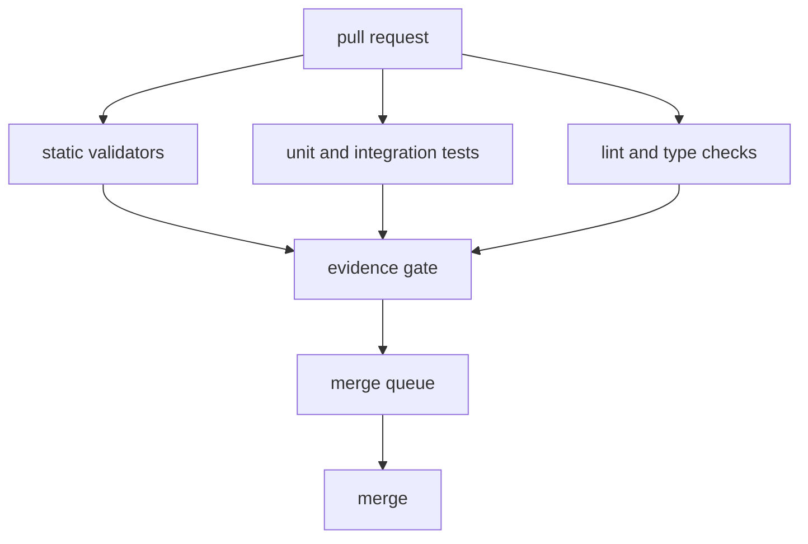
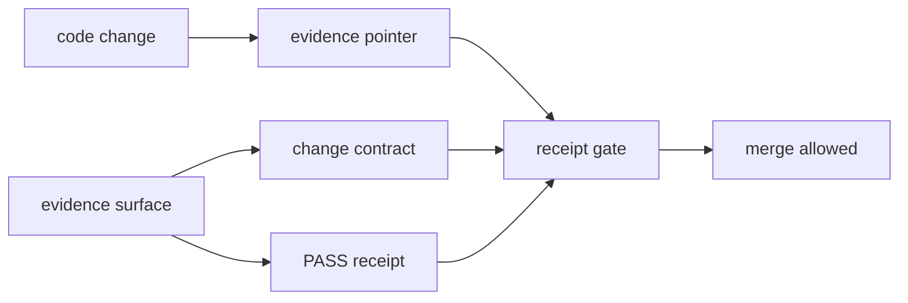

# Technical Design: CI and Full TDD Evidence Gates

## Purpose

Define the public technical design for CI, full TDD practice, validation layers, merge gates, and durable evidence requirements. CI is treated as a proof pipeline, not just a test runner.

## Scope

This design covers:

- fail-first TDD expectations;
- unit, integration, golden-chain, and evidence validation layers;
- required CI gate families;
- merge queue and runner health boundaries;
- evidence receipt pairing;
- current-versus-target enforcement.

## Non-Goals

This design does not publish private runner topology, private hostnames, private repository URLs, work identifiers, authentication material, or operator-specific data. It also does not claim that every target-state TDD gate is currently machine-enforced.

## Full TDD Rule

For implementation work, the expected sequence is:

1. derive behavior from a contract, design document, decision record, or acceptance criterion;
2. write the failing test before implementation;
3. capture the failing output;
4. implement the smallest contract-native change;
5. run targeted tests;
6. run repo-native lint and type checks;
7. run integration or golden-chain proof when behavior crosses runtime, event, projection, registration, or evidence boundaries;
8. bind required evidence before completion.

Return-value-only tests are insufficient for handlers that publish events, materialize projections, write proof artifacts, or call approved effect edges. The test must assert the externally observable effect.

## Validation Layers

| Layer | Design purpose | Example proof |
| --- | --- | --- |
| Unit | Isolated logic correctness. | Focused test result. |
| Contract-to-test | Behavior came from declared contract or acceptance criteria. | Failing test evidence and traceable requirement. |
| Integration | Declared side effects occur. | Event, projection, API, file, or effect assertion. |
| Golden chain | End-to-end event-to-projection flow works. | Source event, terminal event, projection read, replay result. |
| Cross-domain sweep | Shared contracts still compose. | Multi-repo contract or schema validation. |
| Standing sweep | Platform remains clean over time. | Scheduled or repeated validation result. |
| DoD verification | Completion evidence satisfies required proof. | Receipt or durable evidence artifact. |

## CI Gate Families

Required gate families include:

- repo-local tests;
- lint and format checks;
- configured type checks;
- contract compliance;
- handler routing and invocation conformance;
- skip-token or bypass rejection where configured;
- evidence receipt pairing for receipt-gated work;
- deploy or runtime gates when deployment behavior changes.

## Merge Queue and Runner Health

A merge queue is the integration proof boundary. It proves a candidate against the branch state it will enter. Queue failures must be classified before changing merge policy.

Runner health is part of CI correctness. A process that appears alive is not sufficient; the proof surface must establish that jobs can be accepted, dependencies can be fetched, required checks can publish status, and ambiguous check states fail loudly.

## Evidence Receipt Design

Evidence-gated work requires durable pairing between the code change and the proof artifact.

Repo-local proof can support a change, but durable completion proof must be reachable from the shared evidence surface when a receipt gate applies.

## Current Versus Target Enforcement

Current binding rules:

- run repo-local tests, lint, and configured type checks;
- reject bypass behavior where configured;
- require durable evidence pairing for receipt-gated work;
- treat contract, handler, and architecture validators as binding where wired;
- require integration or replay-style proof for runtime and projection claims.

Target-state rules:

- machine-verifiable fail-first TDD ordering across all repositories;
- universal adversarial review gates for architecture-affecting changes;
- fail-closed completion automation for all evidence levels;
- automatic merge freezes on affected paths after golden-chain failures.

The design requires honest labeling. A target-state gate must not be described as current enforcement until it is wired and verified.

## Acceptance Criteria

- CI status is read from the hosting platform and workflow outputs, not from agent summaries.
- Ambiguous CI state fails loudly.
- Handler and effect changes include side-effect assertions.
- Receipt-gated changes have durable evidence pairing.
- Runtime and projection claims include integration or golden-chain proof.
