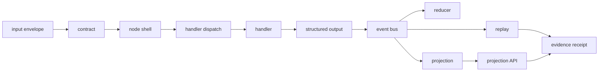
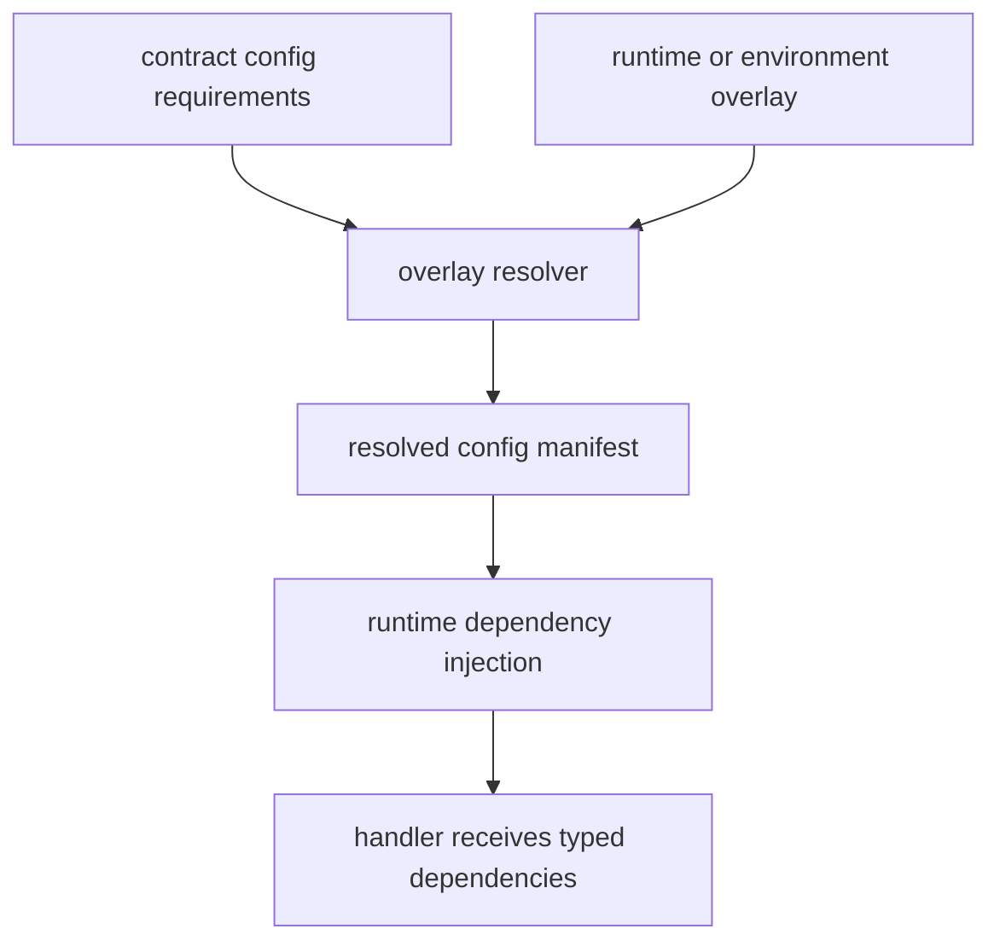

# Technical Design: Contract-Native Platform Architecture

## Purpose

Define the public OmniNode platform architecture in design-document form. The design establishes the primitives, support surfaces, ownership boundaries, runtime flow, and proof requirements for contract-native execution.

## Scope

This design covers:

- contracts, nodes, and handlers as the constructive runtime primitives;
- protocols as structural service boundaries;
- overlays as typed runtime configuration;
- subcontracts, manifests, and projection contracts as support surfaces;
- event-bus execution, reducer/projection ownership, and evidence binding;
- current-versus-target labeling for staged migrations.

## Non-Goals

This design does not publish private topology, private work identifiers, private repository URLs, operator names, hostnames, IP addresses, authentication material, or branch-specific implementation claims. It also does not claim that every target-state validator is wired in every repository.

## Design Principles

- Contracts define allowed runtime reality.
- Nodes are declarative runtime shells.
- Handlers own logic but do not own transport, topics, or authoritative state.
- Protocols decouple handlers and nodes from concrete infrastructure.
- Overlays resolve typed configuration before runtime invocation.
- Events, reducers, projections, replay, and evidence receipts prove truth.
- Dashboards and logs are render or support surfaces, not authoritative truth.

## Runtime Primitives

| Primitive | Design responsibility |
| --- | --- |
| Contract | Declares identity, typed input/output models, topics, handler routing, config requirements, params, failure semantics, and evidence requirements. |
| Node | Provides the runtime shell, lifecycle, subscription binding, dispatch entry, and contracted output publication. |
| Handler | Implements business logic through the platform invocation seam and returns structured output. |

The primitives are intentionally small. They prevent capabilities from growing separate engines, registries, daemons, routers, or direct transport paths outside the declared runtime.

## Support Surfaces

| Surface | Design responsibility |
| --- | --- |
| Protocol | Defines the structural interface an implementation must satisfy. |
| Overlay | Supplies scoped runtime configuration without making process state authoritative. |
| Subcontract | Declares reusable behavior such as retry, dead-letter handling, circuit breaking, cache policy, validation, observability, or finite-state-machine behavior. |
| Manifest | Binds execution, runtime, schema, projection, or evidence identity into durable artifacts. |
| Projection contract | Declares read-model ownership, ordering, freshness, degradation, and schema expectations. |

## Node Package Shape

Portable capabilities should be packaged as contract-native node packages:

```text
node_<capability>/
  contract.yaml
  metadata.yaml
  node.py
  handlers/
  models/
  protocols/
  tests/
```

`contract.yaml` is the source of runtime authority. `metadata.yaml` supports catalog discovery. `node.py` remains a thin shell. Handlers own implementation logic and are selected by contract routing.

## Runtime Flow



The runtime must publish only contracted outputs. Direct database writes, direct broker clients, raw provider calls, and subprocess transport do not belong inside business handlers unless the behavior is explicitly isolated behind an approved platform effect.

## Configuration and Overlay Flow



Handlers should not discover transport lanes, authentication material, route policy, or topics from ambient process state. The contract declares required configuration, overlays supply scoped values, and the resolver produces a durable manifest.

## Projection and Evidence Design

Read truth belongs to reducers and projections built from accepted events. Dashboard surfaces, command output, and logs can support investigation, but release-scoped truth requires event/projection/evidence binding.

A proof bundle should include:

- contract identity and version;
- source event and terminal event identity;
- projection cursor or read-model proof;
- replay or replay-equivalent validation;
- evidence receipt or equivalent durable proof artifact.

## Current Versus Target State

Public design documents must distinguish:

- **current state:** proven by source, tests, CI, runtime evidence, or published artifacts;
- **target state:** intended design direction for active migrations;
- **context:** planning notes, handoffs, or branch-local work that require verification.

This distinction is required for dispatch migration, overlay adoption, generated-node admission, and CI gate coverage.

## Acceptance Criteria

- New platform capabilities map to contracts, nodes, and handlers.
- Runtime configuration is contract-visible and typed.
- Protocols define implementation boundaries without concrete IO construction.
- Projection-backed read paths are labeled and testable.
- Evidence requirements are explicit before a completion claim is accepted.
