# Technical Design: OmniNode Platform Architecture

## Purpose

Define the OmniNode platform architecture as a single, end-to-end public Technical Design Document. This document subsumes the previously separate designs for the contract-native platform, orchestrator nodes, the self-extending agent, and CI/full-TDD evidence gates, and folds in the supporting domains of state and projections, configuration and overlays, runtime registration and registry boundaries, and model/inference routing.

It establishes the primitives the platform is built from, the boundaries between them, how a unit of work flows from a contract through nodes and handlers onto the event bus and into reducers, projections, and durable evidence — and, honestly labeled, where the current implementation diverges from the canonical target. CI is treated as a proof pipeline, not just a test runner; truth is treated as something proven through contracts, events, projections, replay, and durable evidence, not asserted.

## Scope

This design covers:

- contracts, nodes, and handlers as the constructive runtime primitives;
- the four declarative node archetypes and the separate runtime-host kind;
- the dispatch seam (routing parse, glob match, single-protocol fan-out, terminal aggregation);
- orchestration and finite-state-machine workflows coordinated over the bus;
- the event bus as the inter-service transport, with publish/retry/dead-letter/ordering on the bus;
- state, reducers, projections, cursors, and the authoritative-truth boundary;
- configuration via contract requirements, overlays, manifests, subcontracts, and projection contracts;
- the runtime, registration, and registry-owned consumer-surface boundary, and dependency injection;
- the self-extending agent that generates, validates, registers, invokes, and proves new capabilities;
- the model and inference routing boundary;
- CI gate families, the full-TDD validation layers, and evidence/receipt pairing;
- deterministic-truth requirements and proof bundles;
- current-versus-target labeling for the active dispatch/enforcement migrations.

## Non-Goals

This design does not publish private topology, internal work identifiers, internal class or symbol names, private repository URLs, hostnames, IP addresses, runtime-lane port numbers, operator names, secret-provider product names, authentication material, or branch-specific implementation claims. Internal layers are described by role (core layer, service-provider-interface layer, runtime/infra layer, compatibility layer, capability node packages, marketplace/routing layer, agent-plugin layer) rather than by private package name.

This document also **does not claim that reconciliation to the canonical target is complete.** Wide, deliberate divergence between the current running system and the canonical target exists and is held open behind a staged cutover. Where current and target differ, the difference is labeled `current`, `target`, or `divergent`. A target-state gate, seam, or validator is never described as current enforcement until it is wired and verified. Any claim that the dispatch architecture has converged must cite the selection-parity proof and the cutover evidence — neither of which this document asserts as produced.

## Architecture at a Glance

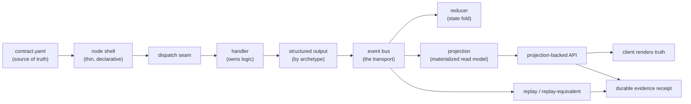

The platform is contract-native: a contract declares what a capability is and what it is allowed to do; a thin node shell binds it to the runtime; a handler implements the logic. Output is published only as the contract permits, and only onto the event bus. Downstream, reducers fold accepted events into state and projections materialize read models; clients render that truth but never create it. Every externally visible result is expected to leave durable, inspectable evidence. The primitives are intentionally small to prevent capabilities from sprouting their own engines, registries, daemons, routers, or direct transport paths outside the declared runtime.

## Core Primitives

The platform is constructed from exactly three primitives. The intent is that no bespoke classes, engines, adapters, routers, daemons, registries, managers, or runners survive outside these primitives and the runtime that hosts them. (This is the canonical target; see **Current Versus Target State**.)

| Primitive | Design responsibility |
| --- | --- |
| **Contract** | The source of runtime authority. Declares identity and version, typed input/output models, subscribe/publish topics, handler routing, config requirements and params, idempotency and retry/dead-letter semantics, failure handling, and evidence requirements. Topics, route policy, and model parameters are never hardcoded in handler source. |
| **Node** | A declarative runtime shell. Provides lifecycle, subscription binding, the dispatch entry, and contracted output publication. In the target, the node shell holds **no** custom logic — it routes to its handlers entirely from its contract. |
| **Handler** | Owns business logic. Implements the platform's single invocation seam and returns structured output. Holds no transport, no topics, and no authoritative state, and performs no undeclared ambient configuration lookup. |

**One handler invocation protocol.** There is exactly one async handler entry point — `handle(envelope) -> handler output` — resident in the core layer. The protocol carries handler identity, category, message types, and node kind. Its core residency is a **deliberate layering exception**: strict layering would place protocols in the service-provider-interface layer, but the protocol references core-resident I/O models, and relocating it would force a forbidden core-to-service-provider-interface import. This exception is a target decision, not a divergence; the platform does not claim a clean protocol-only boundary layer.

A capability is packaged as a contract-native node package:

```text
node_<capability>/
  contract.yaml      # source of runtime authority: handler routing, topics, params, terminal event
  metadata.yaml      # catalog discovery, node role
  node.py            # thin shell — no custom logic (target)
  handlers/          # the logic
  models/            # typed input/output and step models
  protocols/         # structural boundaries
  tests/             # parity, ordering, replay proofs
```

The contract is the runtime authority; the metadata file supports catalog discovery; the node shell is thin; handlers own implementation and are selected by contract routing. The contract declares `publish_topics` / `subscribe_topics` — topics are never hardcoded in Python and that prohibition is CI-enforced.

## Node Archetypes

The platform defines exactly **four** declarative node archetypes, plus a separate runtime-host kind for infrastructure that is not a handler archetype. The archetype enum deliberately excludes the runtime-host kind because a contract cannot declare itself as runtime infrastructure; the runtime-host kind is rejected as a handler node kind.

Each archetype is mechanically constrained to **one** allowed handler-output shape. This constraint is enforced **today** by a model-level validator at output construction: a violation raises a contract-violation error. This is live, not aspirational.

| Archetype | Responsibility | Allowed handler output |
| --- | --- | --- |
| **EFFECT** | External I/O at the boundary; publishes result events about external interactions. | `events[]` only |
| **COMPUTE** | Pure, stateless, deterministic transformation; never dispatches or routes. | `result` only (required unless explicitly allowed void; must be JSON-ledger-safe) |
| **REDUCER** | Pure finite-state fold `delta(state, event) -> (new_state, intents[])` with no I/O. | `projections[]` only |
| **ORCHESTRATOR** | Multi-step workflow coordination; selects and fans out to handlers; aggregates terminal results. | `events[]` and `intents[]` |
| _(runtime host)_ | Infrastructure runtime; not a handler archetype. Rejected as a handler node kind. | _n/a_ |

The output constraint keeps authoritative state and transport out of handler logic by construction: an orchestrator can never return a typed `result` or emit a projection; a reducer can only emit projections; an effect can only emit events; a compute can only return a result.

## Dispatch Seam

The dispatch seam turns one inbound envelope into invocations of every matching handler and then a single aggregated result. In the canonical target it is owned by exactly **two** archetypes — orchestrator and effect. The reducer stays a pure finite-state machine and is excluded from contract-table dispatch; the compute node loses routing entirely, because a compute node never legitimately dispatches.

Conceptually the seam does five things:

1. **Parse the routing table.** Read the contract's handler-routing declaration into a list of dispatch routes.
2. **Derive the selection keys.** From the inbound topic, derive a category; from the envelope, derive a message type (for example, from the payload class name).
3. **Match by glob.** Match routes by topic pattern, category, and message type. A single-segment wildcard (`*`) matches one path segment with no dots; a multi-segment wildcard (`**`) matches across segments. Matching is anchored and case-insensitive.
4. **Fan out the one invocation protocol.** For every matching handler, invoke the single platform protocol `handle(envelope) -> handler output`. There is exactly one handler entry point; the seam never calls bespoke per-handler signatures.
5. **Aggregate.** Collect the per-handler outputs into one dispatch result, isolating per-handler errors so one failing handler does not abort the fan-out.

The seam performs pure routing and fan-out only. It does not own workflow-ordering inference, retry, dead-letter routing, or output-publish ordering — those are runtime and bus responsibilities.

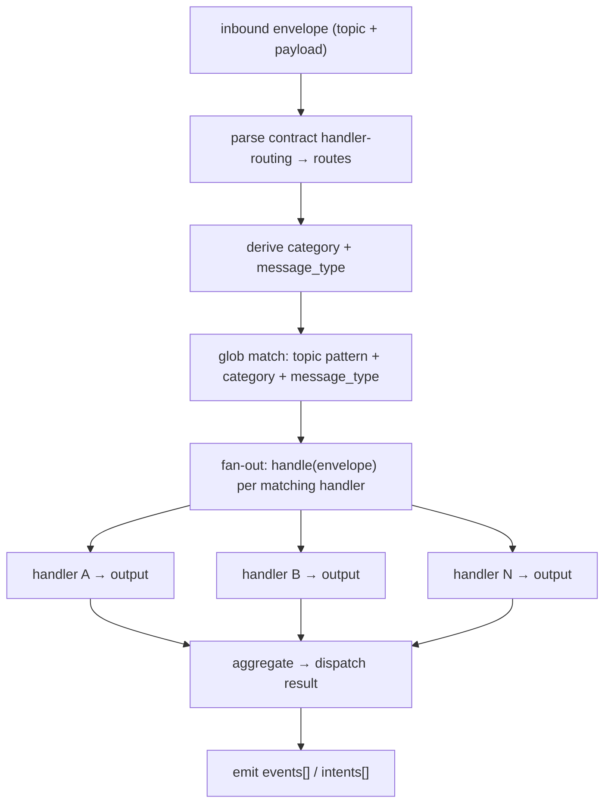

Each handler is dispatched with a context appropriate to its node kind. **Context injection preserves purity:** effect and orchestrator handlers receive a context with an injected current time (clock); compute and reducer handlers receive a deterministic context with **no** clock injection. The runtime-host kind is rejected as a handler kind. The aggregation result model records, per dispatch, the status, route and handler identity, timing, outputs, error message and code, retry count, and correlation/trace/span identity. Per-handler errors are isolated: a failing handler is recorded and the fan-out continues.

## Orchestration & Workflows

An orchestrator node owns a multi-step, workflow-driven, or finite-state-machine-driven capability. Its defining responsibilities are:

- **Handler selection from the contract** — parse the contract's handler-routing declaration into routes and perform stateless, contract-table selection. No business logic in the shell decides which handler runs.
- **Coordination of sub-steps** — own the order in which steps execute and any gate semantics between them (for example, a findings threshold that must be met before a downstream stage proceeds).
- **Terminal aggregation** — aggregate per-handler structured outputs into one dispatch result or one contracted terminal output model.
- **Emission, not return** — emit `events[]` and `intents[]`; never return a typed `result` (compute's job) and never emit `projections[]` (reducer's job).
- **No direct external I/O** — delegate side effects to downstream effect nodes by emitting intents.

An orchestrator coordinates by emitting over the bus, not by calling other nodes' handlers in-process. The canonical coordination shape: the orchestrator emits a command or intent envelope onto a command topic; a downstream node consumes it, does its unit of work, and publishes a terminal event; the orchestrator (or its wiring) consumes the correlated terminal event and aggregates it into the workflow's terminal output.

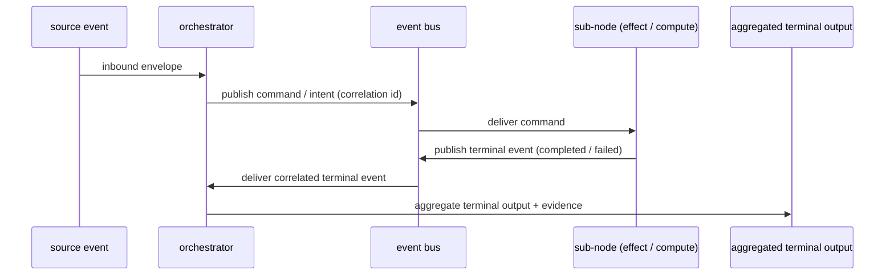

**Decision core.** The pure ordering and gate logic is kept side-effect-free — a common shape is an immutable finite-state-machine state model threaded step to step, each transition producing a new immutable state by copy rather than mutation. All external interactions are injected as protocol-typed boundaries so the decision core stays deterministic and testable.

**Sequential versus parallel sub-steps.** Steps run sequentially when a downstream stage depends on an upstream result or gate; a circuit breaker can halt the machine after a bounded number of consecutive failures. Where steps are independent, the seam's fan-out invokes all matching handlers, and ordering between independently emitted outputs is a bus concern, declared explicitly rather than assumed from arrival order.

**Terminal output shape.** Each orchestrator produces a single typed terminal result model (an external reference, a gate-result model carrying pass/fail and counts, or a verdict plus the ordered transition events and final state) — contracted, not a generic untyped blob.

Two boundaries are load-bearing. Orchestrators **delegate authoritative state**: they coordinate but do not persist; state progression and read-model truth belong to reducers and projections built from accepted events. And orchestrators are **not a place for I/O or transforms**: direct external I/O is the effect archetype's job, pure transformation is the compute archetype's job. The sharpest single line: orchestrators dispatch; computes never do. Lifecycle claims for a dispatched workflow must cite the canonical typed lifecycle-event chain observable on the bus rather than a self-attested local record (see `adrs/ADR-0005-dispatch-lifecycle-canonical.md`).

## Event Bus & Transport

The event bus is **the** inter-service transport. A synchronous HTTP edge is allowed only as a thin publisher or read edge during transition; direct browser reads, local fixtures, and skill output are explicitly not truth surfaces. Each node's contract is the single source of truth for subscribe/publish topics, handler routing, idempotency strategy, and retry policy — topics are never hardcoded in handlers.

**Topic naming convention.** Canonical topics follow `{env}.onex.{evt|cmd}.{producer}.{action}.v{N}`; all topics are currently at `v1`.

**Publish/retry/dead-letter/ordering live on the bus, not in handler code.** Handlers hold no direct bus access; only the coordinating layer publishes. The runtime publishes outputs in causality order: events, then projections, then intents (intents are runtime-internal by default).

**Consumer resilience.** Consumer failures retry with exponential backoff (bounded attempts) and then route to a dead-letter topic (`{original_topic}-dlq`) and commit the offset; the dead-letter payload carries the original event, the error, the failure timestamp, and the consumer group. A circuit breaker (closed / open / half-open, with fast-fail and resilient presets) guards downstream dependency edges, complementing retry and dead-lettering as a degrade-safely mechanism.

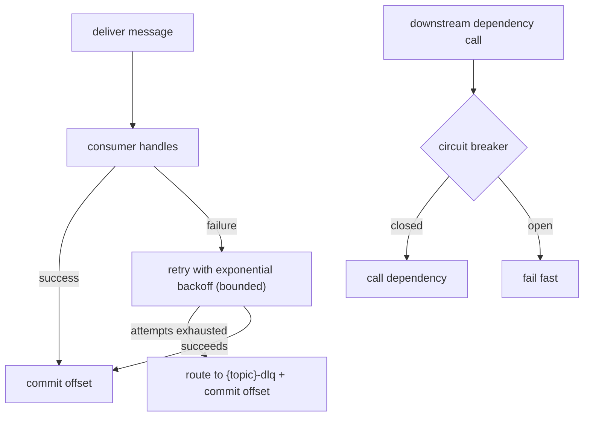

Several transport gaps are open against doctrine and labeled honestly in **Current Versus Target State**: there is no automated dead-letter reprocessor (recovery is manual), the producer edge has no durable buffer (events can drop on a broker outage, so the developer-signal pipeline is fail-open and its recovery-point objective is not zero), and breaking topic-schema migration (add a new `vN` topic, run the old consumer in parallel) is executed manually with no migration tooling yet.

## State, Reducers & Projections

Authoritative truth is owned by the event log, contracted inputs, and materialized projections. **Clients render truth; they do not create it** — they subscribe or request, render, and invalidate-and-refetch; they must not infer state, merge event streams into truth, dedupe authoritative records, or read backend stores directly.

**Reducers fold events into state via a contract FSM.** State progression is defined by the projection's reducer contract: valid finite-state-machine transitions are declared in the contract, not in enum or application code, so transitions are enforced at the architecture layer. A reducer transition validates fail-fast before any write, then proceeds in a fixed order:

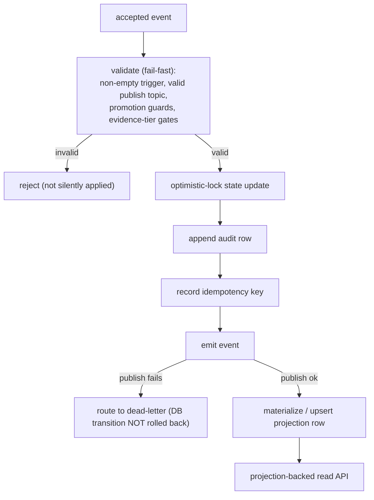

**Canonical reducers win, not arrival order.** Last-write-wins is valid only when a projection contract explicitly declares it; otherwise reducer semantics decide. Arrival order, UI sort order, or an accidental first/last write must never determine truth.

**State is a materialized projection.** State must be explicitly constructed from source events and contracted inputs; a projection owns sequencing, reduction, aggregation, shape, and cursor semantics. There is no hidden authoritative state. Projections derive from a base carrying a canonical key and a version that matches canonical state, designed for version-gated reads with fallback to canonical when projection lag exceeds a threshold.

**Ordering must be explicit and contracted.** Every projection must declare its ordering contract based on an ingest-assigned sequence, a projection version, or another contracted monotonic value. An event timestamp may be used only with an explicitly defined clock authority; no component may rely on incidental arrival order, and cross-source global ordering needs a shared ingest ledger.

**Cursors represent projection progress.** A cursor is not pagination — it is the maximum known truth boundary for a projection: monotonic, projection-scoped, comparable within scope, and derived from a canonical sequence or progress value. The core layer ships projection base, cursor, and watermark models.

**Idempotency.** Effect nodes declare idempotency (a request-identity strategy with a key field); a duplicate request returns the cached result with no write, preventing duplicate transitions on retry. The idempotency key is recorded best-effort after commit.

**Degrade safely.** Correctness is preferred over availability: delay, quarantine, dead-letter, or mark a projection explicitly degraded — never silently drop, guess missing state, reorder without authority, or present degraded data as complete. A projection-backed dashboard realizes this by disabling real-time updates and serving last-successful read-model data after backoff exhaustion.

The doctrine target and the current as-built path differ on ordering, cursors, replay, and the state/bus consistency seam; these gaps are enumerated in **Current Versus Target State**.

## Configuration: Contracts, Overlays, Manifests, Subcontracts, Projection Contracts

Configuration discipline is the spine that makes contracts the source of runtime authority. The flow is **declare → supply → resolve → inject**.

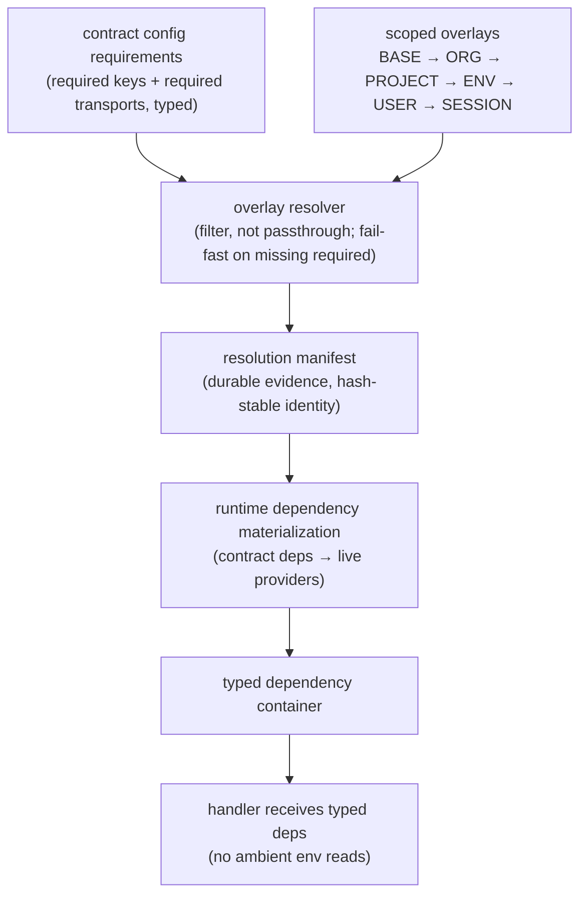

- **Contract config requirements.** A contract declares required config keys and required transport types, aggregated into a typed, frozen requirements model. Contracts — not code — define what config must exist.
- **Overlay files.** A frozen, extra-forbidding, validated schema with environment, scope, and sectioned config. Overlays flatten to key/value pairs with conflicting-duplicate detection, expose a deterministic content hash, and redact secret-named values. They stack in canonical precedence (`BASE → ORG → PROJECT → ENV → USER → SESSION`, higher overriding lower).
- **Resolver.** Filters the loaded overlay against contract requirements — it takes only declared keys, never passes through arbitrary overlay keys, collects missing-optional keys, and **raises** when a required key is absent. Same overlay plus same requirements yields the same resolved set and hashes.
- **Resolution manifest.** A frozen evidence artifact recording overlay file hash, overlay version, scope stack, requirements hash, resolved-config hash, resolved-versus-required transports, runtime version, timestamp, and config source. A stable-identity hash deliberately excludes timestamp and runtime version so identical inputs yield the same identity across boots — an auditable, replayable config artifact.
- **Runtime dependency materialization.** A materializer reads a contract's dependency declarations and creates shared live providers (database pools, broker producers, HTTP clients) from resolved config, with no domain-specific boot code. Resolved protocol dependencies are held in a frozen typed container keyed by protocol and injected into node constructors. Handlers consume resolved deps rather than constructing I/O or reading env for transport lanes, secrets, or topics.

**Subcontracts** are declarative behavior modules referenced from the main contract by relative path plus an integration field, and exist as typed core models: effect, event-bus, compute, introspection, security, lifecycle, health-check, and validation subcontracts, plus retry-policy and circuit-breaker models. The effect subcontract carries discriminated-union I/O configs, idempotency-aware retry, a process-local circuit breaker, transaction config, and observability, and enforces invariants (for example, retry only on idempotent operations; no read retry inside repeatable-read/serializable isolation; no raw operations inside transactions). Retry and dead-letter behavior are contract-declared, not hand-rolled.

**Manifests** are durable identity artifacts. The runtime manifest binds runtime profile, contracts, owned command topics, subscribed event topics, handlers, skipped/failed contracts, ownership violations, image digest, and start time, with computed contract and topology hashes for deterministic identity. Topic ownership is first-class (owned command topics), supporting the one-owner-per-command-topic invariant; ownership violations are tracked as first-class data.

**Projection contracts** are first-class frozen models declaring: the projection name (ownership), source topics consumed, the fully-qualified schema model for rows, a freshness SLA (seconds plus a freshness field and source table), an ordering-contract reference, a cursor contract, and an explicit degraded-behavior choice with **no default** — serve-stale-with-warning, return-empty, or fail-closed.

**Secrets** are referenced through governed provider paths, never inlined: contracts and overlays declare secret references and required keys, the runtime retrieves actual values via an infra-owned governed secret provider, and overlay dumps redact secret-named values.

## Runtime, Registration & Registry Boundary

The runtime, registration, and registry surfaces are separated by two accepted decisions (see `adrs/ADR-0003-registration-runtime-registry-boundary.md` and `adrs/ADR-0004-registry-owned-consumer-surface.md`).

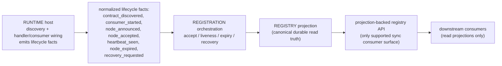

- **Runtime owns discovery and wiring.** The runtime host process is the authority for discovering contracts (package and catalog surfaces), wiring handlers, dispatchers, and subscriptions, starting consumers, and emitting normalized lifecycle facts. It does **not** own durable registry truth or API read semantics. It is the wiring authority.
- **Registration owns orchestration.** Registration is a separate authority that consumes the normalized lifecycle facts plus explicit registry events and orchestrates acceptance, liveness, expiry, and recovery. It does **not** decide what contracts exist and does **not** bootstrap runtime discovery; lifecycle facts are the boundary objects, not raw startup internals.
- **Registry projections own durable read truth.** Registry projections are the sole durable read truth for registration state; runtime memory, startup logs, and compatibility paths are not read truth. Exactly one projection is declared canonical; any storage/effect table is non-canonical, and a legacy compatibility read-model is confirmed absent from the live store.
- **Consumer surface ownership.** The only supported synchronous consumer surface is the registry-owned API backed by a projection reader (node list/detail, discovery summaries derived from projection results). Direct downstream reads from the projection table are not the default integration contract, and snapshot publication is deferred. Downstream consumers read projections only — never tables, never runtime memory.

**Dependency injection is explicitly three-role.** The **container** is the service provider that owns protocol instances; the **runtime resolver** is the wiring authority that resolves and validates (fail-fast: it raises immediately if a required protocol cannot be resolved); the **node** is the consumer that receives resolved protocol dependencies via its constructor. Nodes never self-wire or hand-build buses; there is no manual handler wiring and no null event bus.

## Self-Extending Agent

The self-extending agent generates, validates, registers, invokes, and proves new contract-native capabilities. The design makes deterministic admission gates authoritative instead of trusting generated code or prompts. The agent is **not** a model-routing authority, a deployment bypass, a privileged transport client, or an exception path around platform validation.

The minimum current proof path is `generate → validate → register → invoke → capture evidence`. This five-stage loop exists in current source. Broader surfaces (ingress orchestration, agent orchestration, model-evaluation orchestration, comparison workflows) remain separate design surfaces until each is verified as a contract-native node with evidence.

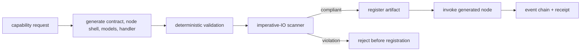

**The load-bearing safety property is admission before registration:** the registration step refuses to register unless validation passed, so invalid generated code cannot become callable. This is genuinely wired in current source.

**Generated artifact requirements.** Every generated node must include a contract declaring node identity, node type, typed models, topics, handler routing, configuration, and evidence requirements; a thin node shell; typed input/output models; handler code using the invocation seam; tests covering contract-derived behavior; and no direct network, broker, database, subprocess, undeclared-topic, or ambient-configuration lookup in generated handler logic.

**Validation gates.** The target rejection criteria are: invalid declared node type; handler signature not matching the invocation seam; handler output shape not matching the declared node type; truncated or incomplete generated output; non-compliant imperative-IO scanning; and topics, route policy, model parameters, or config embedded in source instead of contract-owned. Honestly labeled, the **current** validator implements a narrower set of deterministic checks — required-contract-field presence, syntax parse, a hardcoded-path and topic-literal regex, presence of the top-level handle entry point, and contract-declared model-class presence. The node-type-value validity check, the node-type-versus-output-shape agreement check, the truncation/finish-reason gate, the dedicated imperative-IO scanner verdict, and the generated-test-presence requirement are **target**, not yet in the current validator. The divergence is enumerated in **Current Versus Target State**.

**Generated capability proof** should bind: the generated contract hash, the generated handler hash, the validator identity, the scanner identity, the invocation correlation identity, the source and terminal events, a replay or replay-equivalent result, and a durable receipt.

## Model & Inference Routing Boundary

The binding invariant is that **model selection, escalation, fallback, pricing policy, and route evidence live in the platform routing layer, not in the agent that needs inference.** An agent emits an inference intent and consumes a terminal response; routing nodes own model selection and execution.

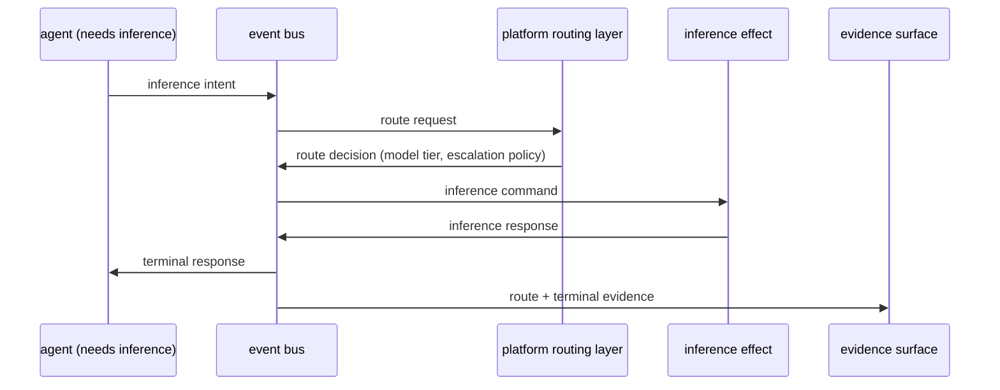

This bus-routed inference boundary is the **target**. In current source the self-extending agent calls a provider endpoint directly in-process and selects the model from a local registry with a fixed token budget — there is no inference-intent emission onto the bus, no routing node owning the decision, and the inference call lives inside the agent rather than in a platform routing/effect node. Route authority, model selection, cost calculation, and retry budgets are therefore currently inside the agent, not external. The divergence is labeled in **Current Versus Target State**. Route decisions and pricing are intended to be route evidence the agent observes, not authority it owns.

## CI & Full-TDD Evidence Gates

CI is a **proof pipeline**, not just a test runner.

**Full TDD ordering.** For implementation work, the expected sequence is: (1) derive behavior from a contract, design document, decision record, or acceptance criterion; (2) write the failing test before implementation; (3) capture the failing output; (4) implement the smallest contract-native change; (5) run targeted tests; (6) run repo-native lint and type checks; (7) run integration or golden-chain proof when behavior crosses a runtime, event, projection, registration, or evidence boundary; (8) bind required evidence before completion.

**Side-effect assertions are mandatory.** Return-value-only tests are insufficient for handlers that publish events, materialize projections, write proof artifacts, or call approved effect edges — the test must assert the externally observable effect.

| Layer | Design purpose | Example proof | Status |
| --- | --- | --- | --- |
| Unit | Isolated logic correctness. | Focused test result. | current (Required) |
| Contract-to-test | Behavior came from a declared contract or acceptance criteria. | Failing-test evidence + traceable requirement. | target (process; fail-first ordering not machine-verified) |
| Integration | Declared side effects occur. | Event, projection, API, file, or effect assertion. | current (Required where wired) |
| Golden chain | End-to-end event-to-projection flow works. | Source event, terminal event, projection read, replay result. | target (replay tooling not yet evidenced as wired) |
| Cross-domain sweep | Shared contracts still compose. | Multi-repo contract or schema validation. | current |
| Standing sweep | Platform stays clean over time. | Scheduled or repeated validation result. | current |
| DoD verification | Completion evidence satisfies required proof. | Receipt or durable evidence artifact. | target (fail-closed completion automation) |

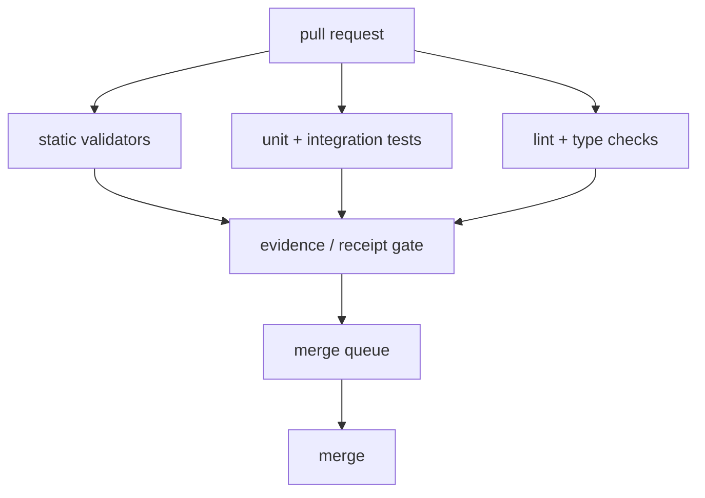

**CI gate families** (honestly scoped per repository) include: repo-local tests; lint and format checks; configured type checks; contract compliance; handler-routing and invocation conformance; skip-token or bypass rejection where configured; evidence-receipt pairing for receipt-gated work; and deploy or runtime gates when deployment behavior changes. The gate set is narrower in some repositories than others — a single repository's gate set must not be cited as platform-wide full-TDD enforcement.

**Merge queue and runner health.** A merge queue is the integration proof boundary: it proves a candidate against the branch state it will enter, and queue failures must be classified before changing merge policy. Runner health is part of CI correctness — a process that appears alive is not sufficient; the proof surface must establish that jobs can be accepted, dependencies fetched, required checks published, and ambiguous check states fail loudly.

**Current versus target enforcement.** Current binding rules: run repo-local tests, lint, and configured type checks; reject bypass behavior where configured; require durable evidence pairing for receipt-gated work; treat contract/handler/architecture validators as binding where wired; require integration or replay-style proof for runtime and projection claims. Target-state rules: machine-verifiable fail-first TDD ordering across all repositories; universal adversarial-review gates for architecture-affecting changes; fail-closed completion automation for all evidence levels; and automatic merge freezes on affected paths after golden-chain failures. A target-state gate must not be described as current enforcement until it is wired and verified.

## Evidence & Deterministic Truth

Truth is proven through contracts, event logs, materialized projections, deterministic replay (or equivalent proof), and durable evidence in approved control-plane surfaces. Status, logs, and completion signals are not truth; clients render truth, they do not create it. A task is not done without durable evidence.

- **Evidence is a first-class output.** Every externally visible operation, state transition, deployment, and completion must emit durable, inspectable evidence — projection snapshots, event receipts, reducer outcomes, validation artifacts, replay outputs, checksums — reachable through approved surfaces (change contracts and receipts, CI, pull requests, committed manifests).
- **Truth must be proven, not claimed.** Truth requires authoritative downstream state reflecting the result, observability through approved boundaries, survival of replay/restart/reprocessing, and durable evidence outside the originating workstation.
- **Deterministic under replay.** The same canonical input sequence plus the same contract/reducer version yields the same projected state. Replay must not depend on wall-clock, consumer arrival order, restarts, or transient state. If replay produces a different authoritative state, the system is incorrect.

A proof bundle should include:

- contract identity and version;
- source-event and terminal-event identity;
- per-step terminal events for each sub-node invoked (for orchestrated workflows), observable on the bus;
- projection cursor or read-model proof for any state advanced;
- replay or replay-equivalent validation;
- a durable evidence receipt or equivalent artifact.

**Evidence/receipt pairing.** Evidence-gated work requires durable pairing between the code change and the proof artifact: a central change contract plus a PASS receipt (with the verifier distinct from the runner) on the shared evidence surface, and a downstream code-change pointer to that evidence. Repo-local proof can support a change, but durable completion proof must be reachable from the shared evidence surface when a receipt gate applies.

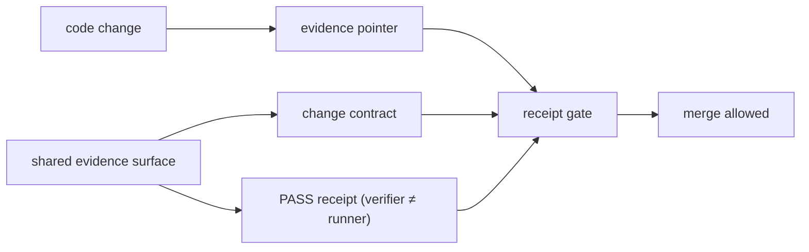

**Data-verification blocking semantics** (see `adrs/ADR-0002-data-verification-invocation.md`): a data-verification failure blocks Done (via a completion guard) but does **not** block PR merge, because verification targets often exist only post-merge or post-deploy. Merge-time correctness is covered by CI and golden-chain proof; data verification is post-deploy confirmation. A partial or timed-out verification is treated as a failure requiring retry. The canonical invocation path for data verification is a command topic on the bus, with a local CLI as a debug/CI fallback that must not satisfy a real Done receipt (the runtime wiring for the bus publisher path on that flow is itself deferred follow-on work).

## Current Versus Target State

Honest labeling is mandatory. The canonical target — three primitives, one node-owned dispatch seam, one handler protocol, zero bespoke engines/routers/legacy compute base classes, bus-as-transport, contract-overlay config — is a **definitive target specification, not current reality.** Source verification confirms wide, deliberate divergence held open behind a staged cutover. The list below uses `current` / `target` / `divergent` labels and does **not** claim convergence is complete.

### Dispatch seam

- **Node-owned dispatch seam does not exist in source** *(divergent)* — the canonical node-owned dispatch mixin is target-only; it is absent from every layer. Only a dead predecessor routing mixin exists.
- **Node-owned routing path is dead code** *(divergent)* — the predecessor mixin's route helper has zero production callers; its only references are its own docstring and one comment in an orchestrator shell.
- **Live dispatch is a freestanding runtime engine** *(divergent)* — production orchestrator/effect dispatch runs entirely inside a freestanding dispatch engine in the runtime/infra layer, wired across multiple runtime modules and driven by bus wiring on every consumed message. This is the live path the public demo runs on, and it must stay live through the demo. The seam's five-step shape and glob dialect described above are implemented in this live engine today; the divergence is **ownership and location**, not behavior.
- **Two duplicate dispatch-engine classes** *(divergent)* — a dead/secondary reference copy in the core layer (zero production importers) coexists with the live infra engine. Both are slated for deletion after the node-owned seam reaches parity.
- **Two divergent routing-entry models share one name** *(divergent)* — the core shape and the infra shape have incompatible required fields; the live contract corpus is authored in the infra shape, so the core class cannot construct from production contracts. A hard schema fork.
- **Aggregation result model is forked** *(divergent)* — a thin dead copy in core and a rich live copy in infra; the dispatch-status enum diverges between them and is unreconciled. The target promotes the rich copy into core and deletes the thin one.
- **Selection-parity is formally NO-GO** *(divergent)* — selecting via the (target) node/mixin path over a contract does not yield what the live engine selects; selection semantics are verified non-equivalent (different keys, a default-handler concept in one only, different glob dialect/case sensitivity, single-handler versus fan-out). Cutover is gated on a corpus-wide selection-parity test that does not yet exist.
- **Four competing invocation conventions** *(divergent)* — against the target of one handler protocol, source carries multiple competing invocation conventions plus local reimplementations (kwargs flattening, duck-typed handle/run/execute, attribute dispatch). Across the capability-node fleet, only a tiny fraction of handle definitions are envelope-conformant and essentially none implement the canonical protocol — a large multi-handler migration, not a single ticket.
- **Some dead routers deleted, others pending** *(divergent)* — one dead core router is confirmed deleted; two infra routers still exist on disk pending deletion, gated behind the cutover.
- **Inline intent-routing duplication persists** *(divergent)* — a duplicated inline intent-to-handler map remains, intended to be replaced with contract-declared intent routing.
- **Dispatch cutover is deferred and sequenced** *(target)* — the cutover is staged (model consolidation → land seam + parity gate → flag → shadow → flip → production with sign-off → delete engines), and the later stages are deliberately post-demo. This is a scheduled divergence, not accidental drift.

### Node shells, archetypes, and legacy classes

- **Concrete node shells are thick, not thin** *(divergent)* — concrete shells do not implement the canonical `handle(envelope)` seam; they expose bespoke `process(input) -> typed_output` signatures and carry substantial workflow/snapshot logic. None parses handler routing into canonical routes or fans out via the one protocol.
- **Compute still carries routing** *(divergent)* — the compute node currently mixes in routing, contradicting the target where compute loses routing entirely. The reducer correctly carries no routing (pure FSM, matches target); orchestrator and effect both carry routing (matches target seam ownership).
- **Legacy compute base class and a live subclass remain** *(divergent)* — against the target "no plugin base class" (compute is the compute archetype), a legacy compute plugin base class still exists with at least one live example subclass — migration debt to be ported to contract + handler.

### Enforcement

- **Architecture validators are mostly advisory** *(divergent)* — against "enforcement not detection," only a narrow daemon-lifecycle guard is wired as a CI job plus pre-commit hook, and only in one repository. The broader node-architecture and handler-routing validators exist but are wired into no gate in any repository.
- **Imperative-IO guard not hard-gated cross-repo** *(divergent)* — a large outstanding set of freestanding imperative-IO violations remains across the ecosystem, a substantial fraction invisible to the official scanner (it only inspects node handler directories). The scanner is a required check in only a few repositories and a pre-commit hook in only one; the target is a hard gate everywhere with allowlists at zero.

### Configuration, transport, and proof

- **Direct-env compatibility fallback** *(divergent)* — boot tolerates a legacy env-var mode (warn and run on env vars when no overlay exists); overlay-only boot is enforced only when a require-overlay flag is set. Overlay-as-sole-authority is target.
- **Transport-config overlay is target-only** *(divergent / target)* — against contract-overlay transport resolution with fail-fast, direct broker-bootstrap env reads remain pervasive, and the planned typed transport-config carrier and runtime-lane enum are not in source. An environment-specific transport-lane misconfiguration (one broker lane masking another via stale shell export) is a recorded live blocker.
- **No automated dead-letter reprocessor** *(divergent)* — dead-lettered messages require manual investigation; there is no documented automated re-drain path.
- **Producer edge has no durable buffer** *(divergent)* — the producer never waits for confirmation and drops events on a broker outage; the developer-signal pipeline's recovery-point objective is not zero. This is an intentional fail-open choice for non-truth developer signals.
- **Live dashboard projection path lacks a documented ordering key and cursor** *(divergent)* — the as-built read path uses leading-edge throttled projection writes, a client poll fallback, and a bounded recent-event initial load, but surfaces no contracted ordering key or projection cursor/watermark. Ordering-must-be-explicit and cursors-represent-projection-progress are doctrine targets not yet evidenced as wired in this read path.
- **DB commit precedes bus emit; bus failure does not roll back state** *(divergent)* — a reducer transition commits the state update and audit row, then emits; if the publish fails the event routes to dead-letter and the committed transition is not rolled back, and the transition also commits when the producer is absent. Authoritative store state can therefore advance while the event/projection lags — a consistency seam against event-sourced truth.
- **Replay tooling not yet evidenced as wired** *(divergent)* — replay is a load-bearing doctrine guarantee and a golden-chain proof input, but no replay harness is documented as implemented. Where replay is absent, a result must be labeled runtime-observed, never replay-proven.
- **Topic schema migration is manual** *(divergent)* — breaking changes add a new `vN` topic and run the old consumer in parallel, but no parallel-consumer migration tooling exists yet.

### Self-extending agent and inference

- **Inference is not yet bus-routed** *(divergent)* — the agent currently calls a provider endpoint directly in-process with local model selection and a fixed token budget; the inference-intent / routing-node / inference-effect bus flow is target. Route authority and cost calculation are currently inside the agent, not external.
- **Invocation uses an in-process tool registry** *(divergent)* — the demo invokes the generated node through an in-process registry, not the live dispatch engine.
- **Validator implements a narrower current check set** *(divergent)* — the node-type-value validity, node-type-versus-output-shape, truncation/finish-reason, dedicated imperative-IO-scanner-verdict, and generated-test-presence gates are target, not in the current validator (which checks field presence, syntax, a path/topic regex, the handle entry point, and model-class presence).
- **Admission before registration is wired** *(current)* — the registration step genuinely refuses to register unless validation passed.
- **The agent's CI gate set is narrower than core/infra repositories** *(current)* — honestly scoped; do not claim platform-wide full-TDD from this repository's gate set.

### Layering note

- **The handler protocol's core home is a deliberate layering exception** *(target)* — strict layering would place it in the service-provider-interface layer, but it references core-resident I/O models and relocation would force a forbidden import. Stated explicitly so the public design does not claim a clean protocol-only boundary layer.

## Acceptance Criteria / Platform Invariants

- New platform capabilities map to the three primitives and are packaged as contract-native node packages with a thin node shell and contract-declared handler routing.
- A node's allowed handler output matches its archetype — effect emits `events[]`, compute returns `result`, reducer emits `projections[]`, orchestrator emits `events[]` and `intents[]` — and this is enforced at output construction.
- Dispatch selection is driven by the contract routing table through the single handler invocation protocol; the seam parses routing, glob-matches, fans out the one protocol, and aggregates, isolating per-handler errors.
- Coordination flows over the event bus; handlers hold no direct bus access and no in-process cross-node handler imports; publish, retry, dead-letter, and ordering live on the bus.
- Authoritative state is delegated to reducers and projections built from accepted events; clients render truth and do not create it; ordering is explicit and contracted; cursors mark the maximum known truth boundary.
- Runtime configuration is contract-visible and typed: contracts declare requirements, scoped overlays supply values, a resolver filters and fails fast on missing required keys, and a hash-stable manifest is the durable evidence; handlers receive typed dependencies and never read ambient process state for transport lanes, secrets, or topics.
- Runtime owns discovery and wiring; registration owns orchestration over normalized lifecycle facts; registry projections own durable read truth; the only supported synchronous consumer surface is the projection-backed registry API; nodes never self-wire.
- Generated capabilities are rejected before registration when they fail validation; generated effect handlers emit effect events rather than performing direct I/O; model-routing authority remains outside the generating agent; a generated artifact is invokable through the runtime and its identity and result are proven by evidence.
- Inference flows as agent-emitted intent into a platform routing layer that owns model selection, escalation, fallback, pricing, and route evidence (target).
- CI status is read from the hosting platform and workflow outputs, not from agent summaries; ambiguous CI state fails loudly; handler and effect changes include side-effect assertions; receipt-gated changes have durable evidence pairing; runtime and projection claims include integration or golden-chain proof.
- Completion is proven, not asserted: a proof bundle binds contract identity, source and terminal events, projection/replay proof, and a durable receipt; truth survives replay/restart/reprocessing and lives durably outside the originating workstation.
- Current-versus-target claims are labeled honestly; any claim that the dispatch architecture has converged cites the selection-parity proof and the cutover evidence — neither of which this document asserts as produced.
