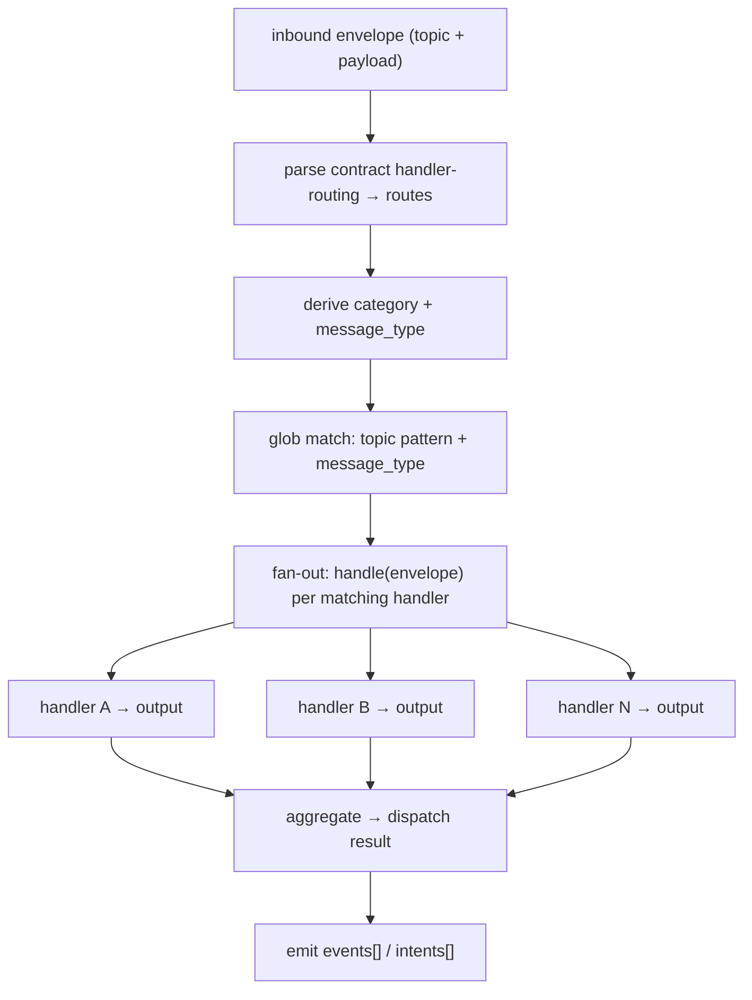
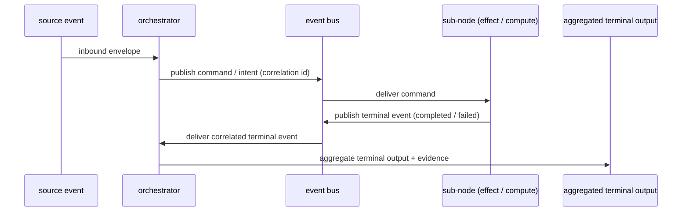

# Technical Design: Orchestrator Nodes

## Purpose

Define the orchestrator node archetype in design-document form. The orchestrator is the workflow-coordination archetype: the node that owns multi-step ordering, handler selection, fan-out, and terminal aggregation across other nodes. This document establishes its responsibilities, its dispatch seam, its relationship to the other archetypes, and — honestly labeled — where the current implementation diverges from the canonical target.

## Scope

This design covers:

- orchestrator placement among the four node archetypes;
- what an orchestrator node owns and what it must delegate;
- the dispatch seam (handler-routing parse, topic and message-type matching, single-protocol fan-out, terminal aggregation);
- coordination over the event bus (commands, intents, terminal events);
- the multi-step / finite-state-machine workflow pattern;
- crisp boundaries against reducer, effect, and compute nodes;
- the current-versus-target gap between today's runtime dispatch surface and the single canonical seam.

## Non-Goals

This design does not publish private topology, internal work identifiers, internal class symbols, private repository URLs, hostnames, IP addresses, operator names, or authentication material. It does not claim the dispatch reconciliation is complete — where current and target differ, the difference is labeled. It does not claim every architecture validator is wired as a gate today.

## Design Principles

- Contracts declare allowed coordination; the node shell holds no logic.
- An orchestrator coordinates work but performs no direct external I/O.
- An orchestrator emits events and intents; it never returns a typed result and never owns a projection.
- The event bus is the transport; publish, retry, dead-letter, and ordering live on the bus, not in handler code.
- Authoritative state belongs to reducers and projections, not to the orchestrator.
- One handler invocation protocol; one node-owned dispatch seam in the canonical target.
- Truth — including dispatch parity — is proven, not asserted.

## Node Archetypes

ONEX defines exactly four declarative node archetypes (with a separate runtime-host kind for infrastructure that is not a handler archetype). Each archetype is constrained by the structured handler output it is allowed to produce.

| Archetype | One-line responsibility | Allowed handler output |
| --- | --- | --- |
| EFFECT | External I/O at the boundary; publishes result events about external interactions. | `events[]` only |
| COMPUTE | Pure, stateless, deterministic transformation; never dispatches or routes. | `result` only |
| REDUCER | Pure finite-state fold `delta(state, event) -> (new_state, intents[])` with no I/O. | `projections[]` only |
| ORCHESTRATOR | Multi-step workflow coordination; selects and fans out to handlers; aggregates terminal results. | `events[]` and `intents[]` |

The orchestrator and the effect are the only two archetypes that own the dispatch seam in the canonical target. The reducer stays a pure finite-state machine and is excluded from contract-table dispatch; the compute node loses routing entirely because a compute node never legitimately dispatches.

## What an Orchestrator Node Is

An orchestrator node owns a multi-step, workflow-driven, or finite-state-machine-driven capability. Its defining responsibilities are:

- **Handler selection from the contract.** The orchestrator parses its contract's handler-routing declaration into routes and performs stateless, contract-table selection — there is no business logic in the node shell deciding which handler runs.
- **Coordination of sub-steps.** It owns the order in which steps execute and any gate semantics between them (for example, a findings threshold that must be met before a downstream stage proceeds).
- **Terminal aggregation.** It aggregates per-handler structured outputs into a single dispatch result or a single contracted terminal output model.
- **Emission, not return.** It emits `events[]` and `intents[]` — it never returns a typed `result` (that is the compute archetype) and never emits `projections[]` (that is the reducer archetype).
- **No direct external I/O.** Direct database writes, direct broker publishing, raw HTTP/gRPC calls, and filesystem writes are forbidden inside the orchestrator. It delegates side effects to effect nodes downstream by emitting intents.

Like every node, the orchestrator is a thin declarative shell. `contract.yaml` is the source of runtime authority: it declares the handler routing plus all topics and parameters. `node.py` carries no custom Python logic; it routes to its handlers entirely from the contract. This mirrors the platform's general primitive model (see `architecture/2026-05-31-contract-native-platform-technical-design.md`).

## Dispatch Seam

The dispatch seam is the mechanism by which an orchestrator turns one inbound envelope into invocations of every matching handler and then a single aggregated result. It is the orchestrator's defining responsibility, and in the canonical target it is shared by exactly two archetypes — orchestrator and effect.

Conceptually the seam does five things:

1. **Parse the routing table.** Read the contract's handler-routing declaration into a list of dispatch routes.
2. **Derive the selection keys.** From the inbound topic, derive a category; from the envelope, derive a message type (for example, from the event type or the payload class name).
3. **Match by glob.** Match routes by topic pattern and message type. A single-segment wildcard (`*`) matches one path segment with no dots; a multi-segment wildcard (`**`) matches across segments. Matching is anchored and case-insensitive.
4. **Fan out the one invocation protocol.** For every matching handler, invoke the single platform protocol `handle(envelope) -> handler output`. There is exactly one handler entry point; the seam does not call bespoke per-handler signatures.
5. **Aggregate.** Collect the per-handler outputs into one dispatch result, isolating per-handler errors so one failing handler does not abort the fan-out.

The seam performs pure routing and fan-out only. It does not own workflow ordering inference, retry, dead-letter routing, or output-publish ordering — those are runtime and bus responsibilities.



Each handler is dispatched with a context appropriate to its node kind. Orchestrator and effect handlers receive a context with an injected current time; reducer and compute handlers receive a deterministic context with no clock injection, preserving their purity.

## Orchestration Over the Bus

An orchestrator coordinates by emitting over the event bus, not by calling other nodes' handlers in-process. The bus is the transport. Output publication, retry policy, dead-letter routing, and ordering all live on the bus and its wiring — not inside handler code. Handlers must not hold direct event-bus access; only the coordinating layer publishes. Direct handler invocation that bypasses the runtime is an architectural violation.

The canonical coordination shape is: the orchestrator emits a command or intent envelope onto a command topic; a downstream node consumes it, does its unit of work, and publishes a terminal event; the orchestrator (or its wiring) consumes the correlated terminal event and aggregates it into the workflow's terminal output.



Publish ordering is a bus and wiring responsibility: a synchronous projection write gates the subsequent publish, so projections settle before intents and events are emitted. The orchestrator does not re-implement ordering, retry, or dead-letter logic in handler code.

## Orchestrator vs Reducer vs Effect vs Compute

The four archetypes are separated by what they own and what output they may produce.

| Distinction | Orchestrator | The other archetype |
| --- | --- | --- |
| vs REDUCER | Owns cross-step ordering and gates; effectful via emitted intents; never owns state. | Reducer is a pure FSM fold with no I/O, emits `projections[]` only, and is excluded from the dispatch seam. |
| vs EFFECT | Coordinates many steps; performs zero direct I/O; emits `events[]` and `intents[]`. | Effect performs one unit of external I/O at the boundary and emits `events[]` only. Both carry the dispatch seam. |
| vs COMPUTE | Selects and invokes handlers; never returns a typed result; impure by virtue of coordination. | Compute is a pure transformation that returns a typed `result`, emits nothing, and never dispatches or routes. |

Two boundaries are load-bearing:

- **Orchestrators delegate authoritative state.** They coordinate but do not persist. State progression and read-model truth belong to reducers and projections built from accepted events (see `doctrine/canonical-reducers-win.md`). An orchestrator that needs a decision core may wrap a pure FSM, but the materialized state is owned by a reducer/projection, not by the orchestrator.
- **Orchestrators are not a place for I/O or transforms.** Direct external I/O is the effect archetype's job; pure transformation is the compute archetype's job. The sharpest single line: orchestrators dispatch; computes never do.

## Workflow / FSM Pattern

A multi-step orchestrator is packaged as a contract-native node package:

```text
node_<capability>_orchestrator/
  contract.yaml      # source of truth: handler routing, topics, params, terminal event
  metadata.yaml      # catalog discovery, node role
  node.py            # thin shell — no custom logic
  handlers/          # the workflow / FSM decision core + step handlers
  models/            # typed request, step, and terminal result models
  tests/             # parity, ordering, and replay proofs
```

**Decision core.** The pure ordering and gate logic is kept side-effect-free. A common shape is an immutable finite-state-machine state model that is threaded step-to-step, with each transition producing a new immutable state by copy rather than mutation. All external interactions are injected as protocol-typed boundaries so the decision core itself stays deterministic and testable.

**Sequential versus parallel sub-steps.** Steps run sequentially when a downstream stage depends on an upstream result or gate (for example, a stage that proceeds only when a findings count meets a contracted threshold). A circuit breaker can halt the FSM after a bounded number of consecutive failures. Where steps are independent, the dispatch seam's fan-out invokes all matching handlers; ordering between independent emitted outputs is a bus concern, declared explicitly rather than assumed from arrival order (see `doctrine/ordering-must-be-explicit.md`).

**Step-output aggregation.** Outputs aggregate by threading typed models step-to-step — there is no shared mutable state object. One-shot orchestrators pass each step's typed return into the next call; FSM orchestrators accumulate into the immutable state model across transitions.

**Terminal output shape.** Each orchestrator produces a single typed terminal result model (for example, an external reference, a gate-result model carrying pass/fail and counts, or a verdict plus the ordered transition events and final state). The terminal output is contracted, not a generic untyped blob.

## Current Versus Target State

Honest labeling is mandatory: the orchestrator dispatch architecture is mid-migration. The single canonical seam is the target; it is not the live runtime path.

- **Target.** Exactly one node-owned dispatch seam — a dispatch mixin composed onto the orchestrator and effect node bases in the core layer — sharing one handler protocol and contract-table selection. The reducer is excluded (FSM-routed); the compute node loses routing. The aggregation result model is promoted into the core layer; the dispatch-engine protocol moves to the service-provider-interface layer. Legacy routing components are deleted once parity is proven. The aggregated terminal output binds to evidence.
- **Current.** Orchestrator and effect handler dispatch executes inside a freestanding dispatch engine in the runtime/infra layer, driven by the bus wiring on every consumed message. This is the live production path and is what the public demo runs on. The canonical node-owned seam does not yet exist in source.
- **Divergent (open gaps, must be reconciled before the cutover):**
  - The canonical node-owned dispatch seam does not exist in any layer yet; it is a design specification, not landed code.
  - The dispatch engine is duplicated — a reference copy in the core layer with no production importers, and the live copy in the runtime/infra layer. Both are slated for deletion once the node-owned seam reaches parity.
  - The core layer's node-owned routing helper is dead for dispatch (zero production callers) and cannot parse the live contract corpus, because two physically different routing-entry models share one name with incompatible required fields. The live contracts are authored in the runtime/infra shape.
  - Selection semantics are verified non-equivalent between the dead core helper and the live engine: different dispatch keys, a default-handler concept present in one and absent in the other, different glob dialect and case sensitivity, and single-handler versus fan-out behavior. Reconciliation is a NO-GO under any design that keeps two selectors until a corpus-wide selection-parity test loads the full contract corpus and passes.
  - The aggregation result model exists as both a thin dead copy in the core layer and the rich live copy in the runtime/infra layer; the dispatch-status enum diverges between them. Neither is reconciled.
  - An intent-to-effect routing path is duplicated inline in a reducer node instead of going through contract-declared handler routing.
  - Confirmed-dead routing components remain on disk pending deletion, gated behind the cutover sequence.
  - The architecture validators that would enforce dispatch-seam ownership exist but are wired into no CI gate or pre-commit hook today, so the seam-ownership rules are advisory, not mechanically enforced.
  - Concrete orchestrator packages do not yet adopt the canonical single handler protocol: they expose bespoke `handle(domain_model) -> domain_result` signatures and hand-roll their own sequential composition (a ports facade, an inline stage chain, or a single dispatch port). None parses handler-routing into the canonical routes or fans out via the one protocol.
  - Archetype labeling is not uniform: one package declares a legacy generic-orchestrator type string, and one functionally-orchestrator package is declared as a `workflow` type with a stubbed node shell and a separate runner that constructs sub-handlers in Python — a manual-wiring surface distinct from contract-driven dispatch.
  - Bus command-and-terminal-event round-trips are realized in only one package; others compose in-process through injected ports and never publish sub-commands or consume sub-node terminal events on the bus, so some contract-declared bus topology is currently aspirational. One package even carries a non-bus transport fallback.

The cutover (shadow, flip, production, cleanup) is intentionally deferred and sequenced; the current-versus-target gap is scheduled, not accidental drift. Any document or change claiming a final, converged dispatch architecture must cite the selection-parity proof and the cutover evidence.

## Evidence Requirements

An orchestrated workflow's completion is proven, not asserted (see `doctrine/truth-must-be-proven.md` and `doctrine/evidence-is-first-class-output.md`). A proof bundle should include:

- the source event that triggered the workflow, with contract identity and version;
- per-step terminal events for each sub-node invoked, observable on the bus;
- the aggregated terminal event or terminal output model the orchestrator emitted;
- projection cursor or read-model proof for any state the workflow advanced (owned by reducers/projections, not the orchestrator);
- replay or replay-equivalent validation of the workflow ordering and gates;
- a durable evidence receipt or equivalent artifact.

Lifecycle claims for a dispatched workflow must cite the canonical typed lifecycle-event chain observable on the bus rather than a self-attested local record (see `adrs/ADR-0005-dispatch-lifecycle-canonical.md`).

## Acceptance Criteria

- An orchestrator capability is packaged as a contract-native node package with a thin node shell and contract-declared handler routing.
- The orchestrator emits `events[]` and `intents[]` only — never `result`, never `projections[]` — and performs no direct external I/O.
- Coordination flows over the event bus; handlers hold no direct bus access and no in-process cross-node handler imports.
- Authoritative state is delegated to reducers and projections; the orchestrator owns ordering and gates, not persistence.
- Dispatch selection is driven by the contract routing table through the single handler invocation protocol.
- Current-versus-target dispatch claims are labeled; any convergence claim cites selection-parity and cutover evidence.
- Workflow completion is proven by a source event, per-step terminal events, an aggregated terminal output, projection/replay proof, and a durable receipt.
