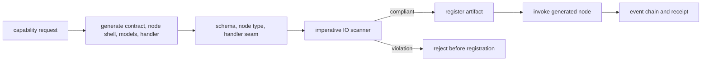
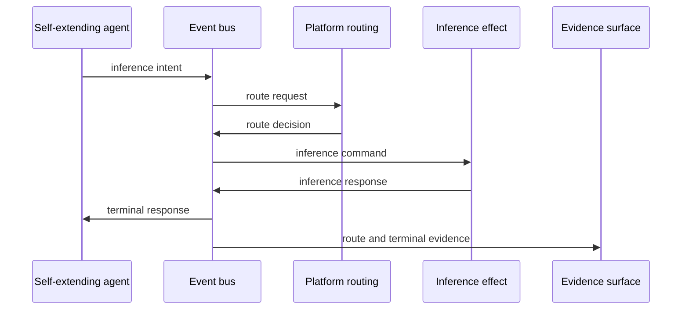

# Technical Design: Self-Extending Agent

## Purpose

Define the public technical design for an agent that can generate, validate, register, invoke, and prove new contract-native capabilities. The design makes deterministic admission gates authoritative instead of trusting generated code or prompts.

## Scope

This design covers:

- generation of contract-native node artifacts;
- deterministic validation before registration;
- imperative-IO rejection for generated handlers;
- registration with durable identity;
- invocation through the platform runtime;
- evidence capture for the generated capability.

## Non-Goals

The self-extending agent is not a model-routing authority, deployment bypass, privileged transport client, or exception path around platform validation. This design does not publish private work identifiers, private repository URLs, private hostnames, authentication material, or branch-specific implementation details.

## Public Verification Boundary

Development notes and branch-local work are not the same thing as current public architecture. A surrounding surface counts as implemented only when source, tests, and evidence show it is contract-native.

The minimum current proof path is:

```text
generate -> validate -> register -> invoke -> capture evidence
```

Broader surfaces such as ingress orchestration, agent orchestration, model-evaluation orchestration, and comparison workflows remain separate design surfaces until each is verified as a contract-native node with evidence.

## Core Loop



The safety property is admission before registration. Invalid generated code must be rejected before it becomes callable.

## Generated Artifact Requirements

Every generated node must include:

- `contract.yaml` declaring node identity, node type, typed models, topics, handler routing, configuration, and evidence requirements;
- a thin `node.py` shell;
- typed input/output models;
- handler code using the platform invocation seam;
- tests covering the contract-derived behavior;
- no direct network, broker, database, subprocess, undeclared topic, or ambient configuration lookup in generated handler logic.

## Validation Gates

The generated artifact is rejected when:

1. the declared node type is invalid;
2. the handler signature does not match the invocation seam;
3. the handler output shape does not match the declared node type;
4. generated output is truncated or incomplete;
5. imperative IO scanning is not compliant;
6. topics, route policy, model parameters, or config are embedded in source instead of contract-owned.

## Inference and Routing Boundary

The self-extending agent emits inference intents and consumes terminal responses. Routing, escalation, pricing policy, selected model identity, and route evidence belong to platform routing nodes.



## Node Surface Boundaries

A surface is platform-native only when it has:

- a contract;
- a thin node shell;
- handlers selected by contract routing;
- deterministic validation;
- runtime invocation evidence;
- contracted output publication.

Local daemons, plain classes, direct adapters, and script-style runners may exist during migration, but they are target work until converted to the node shape above.

## Evidence Requirements

Generated capability proof should bind:

- generated contract hash;
- generated handler hash;
- validator version or identity;
- scanner version or identity;
- invocation correlation identity;
- source and terminal events;
- replay or replay-equivalent result;
- receipt or durable proof artifact.

## Acceptance Criteria

- Invalid generated artifacts are rejected before registration.
- Generated effect handlers return effect events rather than performing direct IO.
- Model routing authority remains outside the self-extending agent.
- A generated artifact can be invoked through the platform runtime.
- Evidence proves the generated artifact identity and invocation result.
