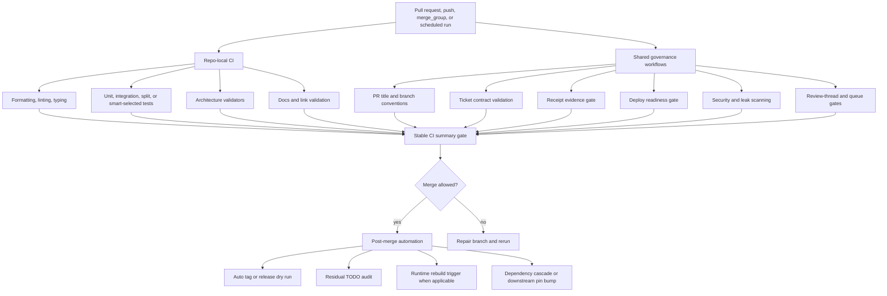
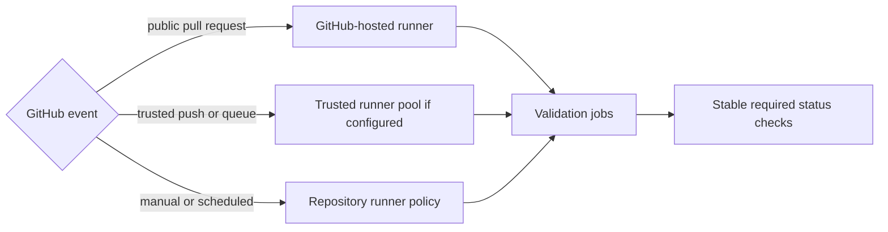
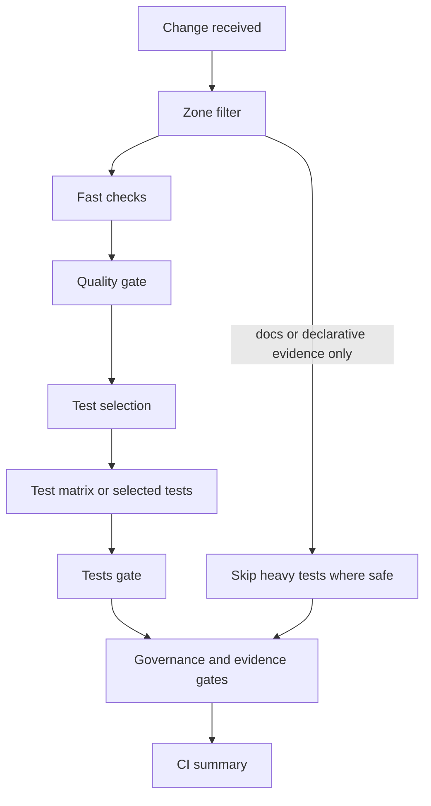
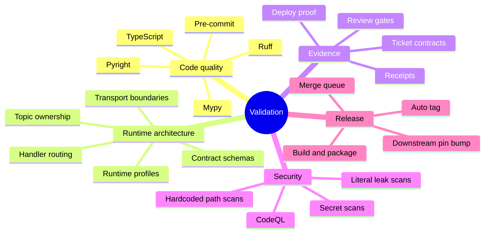
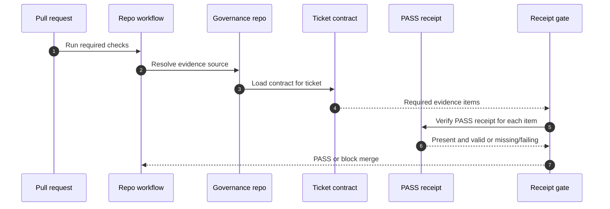
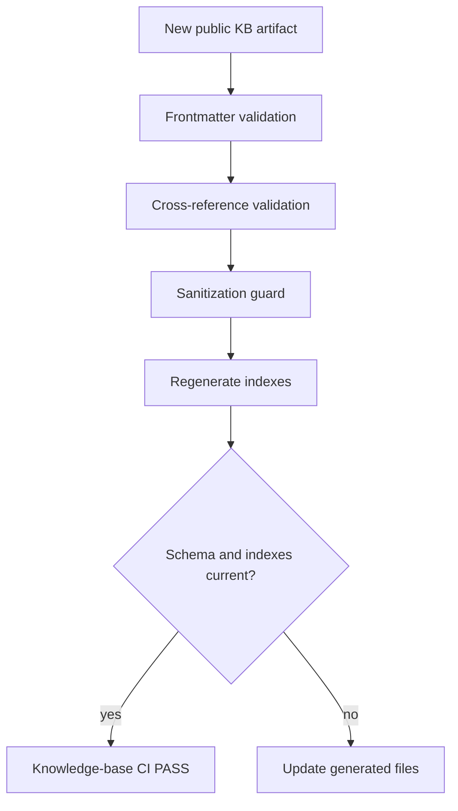
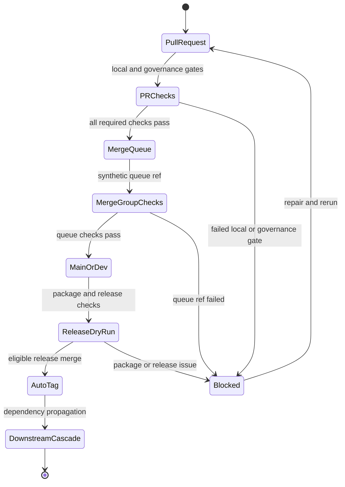
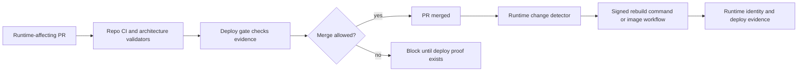
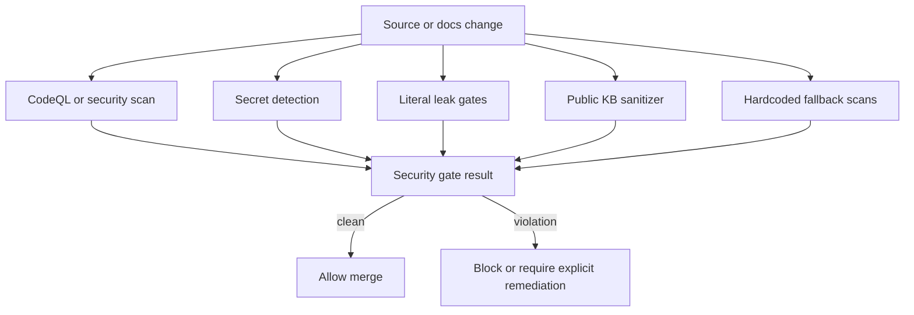

# Public CI and Validation Architecture

## Summary

OmniNode's public CI system is a multi-repository validation mesh. Each public repository owns local correctness checks for its layer, while shared governance workflows enforce cross-repository invariants: ticket contracts, receipt evidence, skip-token rejection, pull request title discipline, security scanning, stale work detection, deploy proof, contract compatibility, and merge-queue revalidation.

The important design point is that CI is not only a test runner. It is an enforcement system for the deterministic truth doctrine:

- code quality must pass before expensive test matrices run;
- contracts must validate before runtime behavior can be claimed;
- receipt evidence must exist before completion can be accepted;
- runtime-affecting changes must prove deploy readiness;
- dashboard and agent surfaces must render or invoke authoritative runtime paths, not local substitutes;
- public knowledge artifacts must pass frontmatter, reference, index, and sanitization validation before publication.

## Public Repository Scope

This document covers public-facing repositories only:

| Repository | CI role |
| --- | --- |
| `omnibase_core` | Kernel, contract, model, validator, and reusable CI workflow authority. |
| `omnibase_spi` | Protocol interface validation and namespace purity. |
| `omnibase_compat` | Cross-repo wire DTO compatibility, shim TTLs, and upstream schema compatibility. |
| `omnibase_infra` | Runtime host, event bus, handler wiring, deploy gates, runtime image/build validation. |
| `omnimarket` | Portable workflow package validation, node drift gates, topic/config guardrails, smart tests. |
| `onex_change_control` | Governance schemas, receipt gates, reusable policy workflows, drift and doctrine checks. |
| `omniclaude` | Hook, skill, plugin, deploy-gate, and edge-adapter validation. |
| `omniintelligence` | Intelligence service validation, pre-commit alignment, scoped tests, code-review checks. |
| `omnimemory` | Memory domain validation, transport boundary checks, migration freeze, model conventions. |
| `omnidash` | Frontend typecheck, tests, Storybook build, projection/data-source guardrails. |
| `onex-self-extending-agent` | Lab harness lint, typing, unit tests, hardcoded path/topic safety checks. |
| `knowledge-base` | Public artifact validation, sanitization, cross-references, generated indexes. |

## CI Architecture At A Glance



## Event Triggers And Runner Policy

Public CI generally runs on four event classes:

| Event | Purpose |
| --- | --- |
| `pull_request` | Validate contributor changes before merge. |
| `merge_group` | Re-run required checks on merge-queue synthetic refs so stale PR results cannot satisfy queue entry. |
| `push` | Validate branch heads after merge, release branches, or hotfix branches. |
| `schedule` / `workflow_dispatch` | Run periodic security, nightly, release, or manual diagnostic checks. |

Runner selection is deliberately split:

- public pull request events default to GitHub-hosted runners;
- trusted pushes, merge queues, and internal branches may use self-hosted runners through repository or organization variables;
- reusable workflows keep stable status names so branch protection can depend on them without depending on individual implementation job names.



## Common Pipeline Shape

Most Python repositories follow the same broad pipeline:

1. Detect whether the change is docs-only or evidence-only.
2. Run fast validation jobs in parallel.
3. Aggregate fast checks into a stable quality gate.
4. Run test shards or smart-selected tests only after fast checks pass.
5. Aggregate tests into a stable tests gate.
6. Run governance gates that inspect contracts, receipts, deploy readiness, security posture, and branch conventions.
7. Publish a final CI summary.

Frontend repositories use the same concept with TypeScript-oriented jobs: install dependencies, typecheck frontend and server surfaces, lint, run tests with coverage, and build Storybook when appropriate.



## Validation Taxonomy

OmniNode validation is intentionally redundant. Different validators protect different failure classes.

| Validation family | What it catches |
| --- | --- |
| Formatting and linting | Style drift, import ordering issues, unsafe lint patterns. |
| Static typing | Python and TypeScript type errors, API drift, incompatible model usage. |
| Unit tests | Local behavior and model/handler correctness. |
| Integration tests | Runtime, storage, event bus, migration, and adapter behavior where available. |
| Contract validation | Invalid ticket contracts, invalid node contracts, schema drift, missing required fields. |
| Architecture validators | Layer violations, direct transport imports, topic hardcoding, plugin lifecycle drift, handler wiring gaps. |
| Security scans | CodeQL, secret detection, internal literal leaks, hardcoded path and topic scans. |
| Evidence gates | Required completion evidence, receipt presence, deploy proof, and proof-source pinning. |
| Review and queue gates | Review thread status, merge-queue revalidation, stale check-name protection. |
| Release gates | Build, tag, package, and release dry-run validation. |



## Shared Governance Workflows

The public repositories share reusable governance logic rather than re-implementing it in every repo.

| Shared gate | Canonical behavior |
| --- | --- |
| PR title check | Enforces branch/PR naming conventions and ticket-aware titles. |
| Contract validation | Extracts a ticket identifier from branch context and validates a matching contract when present. |
| Receipt gate | Verifies that required evidence items have PASS receipts at the canonical governance location. |
| Deploy gate | Requires deploy evidence for runtime-impacting changes. |
| Reject-skip gate | Blocks skip-token bypass patterns from entering the merge queue. |
| Review-thread gate | Prevents unresolved review comments from being hidden by green tests. |
| Security scan | Centralizes CodeQL and security-and-quality query policy. |
| Stale TODO gate | Prevents changed code from carrying TODO references to terminal tickets. |
| TODO audit on merge | Creates or prompts follow-up cleanup when residual TODOs survive merge. |

The receipt gate is the strongest example of the design: completion is not inferred from test success or PR mergeability. Completion requires a contract-defined evidence item and a durable PASS receipt.



## Repository-Specific Validation Logic

### `omnibase_core`

The kernel CI is the reference implementation for fail-fast ordering and stable gate names. It runs formatting, linting, strict typing, pyright, export validation, docs validation, node purity checks, architecture boundaries, enum governance, secret detection, and a large parallel test matrix. It also hosts reusable workflows such as zone filtering and several validator gates.

Key validation themes:

- core model and contract integrity;
- no transport or infrastructure import leakage into kernel code;
- deterministic skill and routing constraints;
- stable public gate names for branch protection;
- expensive tests deferred until fast quality checks pass.

### `omnibase_spi`

SPI validation protects protocol purity. It runs a comprehensive protocol validator over protocol modules, emits machine-readable reports, and fails on protocol errors. The repo also runs namespace validation, docs validation, security scanning, title checks, contract validation, and standards compliance.

Key validation themes:

- protocol interfaces remain interfaces, not implementations;
- public protocol domains remain namespace-clean;
- generated reports are uploaded for inspection;
- warning and error counts are parsed from validator output.

### `omnibase_compat`

Compatibility CI verifies that shared wire DTOs and compatibility shims do not drift from upstream governance schemas. It checks schema artifacts against the governance package, enforces major-version compatibility, and blocks expired compatibility shims through a shim TTL gate.

Key validation themes:

- zero upstream runtime dependency boundary;
- compatibility shims must have valid retention windows;
- schema consumers must not silently accept breaking upstream changes.

### `omnibase_infra`

Infrastructure CI validates the runtime host, event bus, handler loading, configuration, and deploy boundary. It uses zone filtering, linting, strict typing, ONEX validators, architecture layer checks, I/O purity audits, database quality gates, contract batch validation, handler ownership checks, fingerprint drift checks, integration checks, deploy gates, Docker builds, runtime rebuild triggers, and migration image workflows.

Key validation themes:

- runtime code must not hide configuration fallbacks;
- handler and node wiring must be declared and owned;
- runtime-affecting changes require deploy evidence;
- runtime rebuilds are triggered after merged runtime changes;
- CI uses in-memory transport for tests where no broker is available.

### `omnimarket`

Market CI validates portable workflow nodes. It combines linting, strict typing, smart test selection, split test runs, hardcoded topic checks, node metadata dependency checks, no-env-fallback validation, delegation environment-read enforcement, unimported-handler checks, node drift gates, plugin compatibility gates, leaked literal gates, dependency health gates, and release dry runs.

Key validation themes:

- every node must have a contract and entry point;
- topic bindings belong in contracts or generated/central topic surfaces;
- handlers must be importable and reachable by runtime wiring;
- model, dependency, and runtime compatibility must be explicit.

### `onex_change_control`

The governance repo validates its own schemas and reusable enforcement tools. It runs pre-commit, mypy, tests with coverage, schema purity, no-localhost fallback checks, AI-pattern checks, context-integrity contract checks, doctrine coverage checks, security scans, and reusable gates for other repos.

Key validation themes:

- governance schemas must be pure data models;
- reusable gates must be tested where they are authored;
- doctrine coverage must not regress;
- completion evidence must remain independently verifiable.

### `omniclaude`

Omniclaude CI protects the edge integration surface: hooks, skills, plugin install behavior, agent config, reviewdog integrations, deploy gate reuse, plugin compatibility, and skill backing-node liveness. It validates that skills are thin wrappers over live market nodes and that hook scripts use state directories rather than plugin source directories for runtime state.

Key validation themes:

- skills must not become hidden workflow engines;
- every skill claim should be backed by a live node or explicitly limited;
- hook state must live in configured state directories;
- plugin and deployment skip bypasses are rejected.

### `omniintelligence`

Intelligence CI focuses on scoped production code validation, pre-commit alignment, no-Poetry enforcement, changed-file detection, ruff/mypy checks, tests, review-bot checks, docs validation, and security scanning.

Key validation themes:

- CI and pre-commit scopes must stay aligned;
- uv is the package manager of record;
- mature test scopes are explicit;
- intelligence checks are scoped to reduce noisy broad runs while preserving key production guarantees.

### `omnimemory`

Memory CI validates model conventions, transport boundaries, migration freeze, linting, pyright, mypy, ONEX pattern validators, HTTP/Kafka import boundaries, no-env-fallbacks, contract linting, and I/O audits.

Key validation themes:

- memory models follow strict naming and one-class-per-file conventions;
- transport clients stay behind adapters;
- storage/migration changes respect freeze rules;
- memory nodes do not smuggle runtime transport dependencies into domain logic.

### `omnidash`

Dashboard CI uses Node and TypeScript validation: dependency install, environment-contamination checks, frontend typecheck, server/vite typecheck, lint, coverage tests, Storybook build, hardcoded fallback scans, hardcoded delegation reference scans, golden-chain coverage, and schema/type sync checks.

Key validation themes:

- dashboard components render projection/API truth rather than owning truth;
- fixture and fallback paths are explicit;
- UI data-source defaults cannot silently drift back to local-only behavior;
- Storybook remains buildable as a public component proof surface.

### `onex-self-extending-agent`

SEA CI is intentionally compact: lint, format, strict typing, unit tests, hardcoded path scans, and hardcoded topic scans.

Key validation themes:

- generated node and lab-harness code stays deterministic;
- hardcoded local paths and topic strings do not enter source;
- testable lab behavior remains separate from production runtime authority.

### `knowledge-base`

Knowledge-base CI validates public artifacts:

- scripts must pass ruff lint and format checks;
- every artifact must have valid frontmatter;
- `refs` must point at existing public KB files;
- sanitizer rules block internal tickets, internal hosts, non-KB OmniNode GitHub URLs, secrets-manager references, and email addresses;
- generated indexes must be up to date.



## Branch, Queue, And Release Validation

OmniNode public CI treats merge queue and release validation as separate from ordinary PR checks.

- PR checks validate the branch as proposed.
- Merge-group checks validate the proposed queue result.
- Release dry-run checks validate packaging and release mechanics without publishing.
- Auto-tag workflows tag successful merges only after expected gates pass.
- Downstream pin-bump and dependency-cascade workflows propagate compatible releases where configured.



## Runtime And Deploy Gates

Runtime-impacting repositories add deploy and rebuild checks on top of normal CI. The deploy gate verifies that runtime changes carry evidence. Runtime rebuild triggers notify deploy infrastructure only after a merged change matches runtime-change criteria such as labels or changed runtime paths.



## Security And Public Sanitization Logic

Security validation is layered:

1. CodeQL and security-and-quality query suites scan code.
2. Secret scanners detect credential-like strings.
3. Literal leak gates reject internal IPs, local paths, raw environment reads, model IDs, and other governed literals unless explicitly annotated where the repo permits annotations.
4. Public KB sanitization blocks internal tickets, internal host references, non-KB OmniNode GitHub URLs, secrets-manager references, and email addresses.
5. Dashboard and hook workflows block hardcoded local-only data paths that would make public or runtime behavior non-reproducible.



## Why This CI Design Exists

The public CI architecture is built around three lessons:

1. Test success is not enough. A test suite can be green while contracts, receipts, runtime identity, or deployment evidence are missing.
2. Local correctness is not enough. Cross-repository platforms need reusable governance gates that verify public contracts and shared evidence.
3. Fast feedback matters. Cheap checks should fail before expensive test matrices and runtime checks consume capacity.

The result is a system where pull requests are evaluated by layered evidence:

```text
style and type correctness
  -> local tests
  -> architecture validators
  -> contract validation
  -> receipt and deploy evidence
  -> merge queue revalidation
  -> release and downstream propagation
```

## Open Questions

- Which reusable gates should become a single public "OmniNode CI baseline" workflow instead of many per-repo callers?
- Which repo-specific validators are general enough to promote into `onex_change_control` or `omnibase_core`?
- How should public documentation expose required check names without coupling readers to transient job implementation names?
- Which release dry-run and downstream cascade paths should be mandatory for every package repo versus only for runtime-critical packages?

## Follow-up Work

- Keep this document updated as public repositories add or remove required workflows.
- Add a compact public matrix of required status checks once branch protection state is intentionally public.
- Promote common validator patterns into reusable actions where duplication remains.
- Add rendered SVG exports for the Mermaid diagrams if the public docs site requires static assets.
