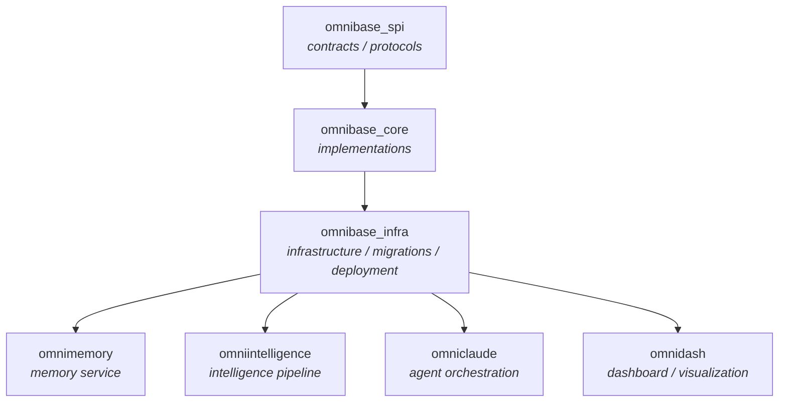

# Cross-Repo Merge Dependency Graph

**Purpose**: Cross-repo merge ordering for coordinated multi-repo releases
**Source**: omnibase_core `docs/standards/MERGE_DEPENDENCY_GRAPH.md`

---

## Overview

On high-throughput days, merge ordering is critical: SPI contracts must land before infra
migrations that depend on them; intelligence-service code must release before infra
activation PRs that bump its version. The dependency graph below defines the canonical merge
order for coordinated multi-repo releases. Violating this order can cause version skew,
broken migrations, or failed deployments.

## Dependency Graph



| Layer | Repos | Role |
|-------|-------|------|
| **L0 — Contracts** | `omnibase_spi` | Pydantic protocols, SPI interfaces, shared type contracts |
| **L1 — Core** | `omnibase_core` | Concrete implementations of L0 contracts, shared models |
| **L2 — Infra** | `omnibase_infra` | Infrastructure services, DB migrations, Kafka config, deployment |
| **L3 — Services** | `omnimemory`, `omniintelligence`, `omniclaude`, `omnidash` | Application services that depend on L2 infra |

---

## When Ordering Matters

Merge ordering is **required** when a change in an upstream repo creates a dependency that
downstream repos must satisfy before or at the same time.

1. **SPI Contract Changes (L0 → L1)** — a PR in `omnibase_spi` adds/renames/removes a
   protocol method, field, or type. `omnibase_core` implements those contracts; if the Core
   PR merges first, it references a contract that doesn't exist on the default branch yet.
   **Rule**: merge the SPI PR first.
2. **Core Model Changes (L1 → L2)** — a Core PR changes a shared model that Infra
   references in a migration, handler, or config extractor. **Rule**: merge Core first.
3. **Version Bumps (L2 → L3)** — an Infra PR bumps a pinned service version in a deployment
   manifest. **Rule**: merge the service PR first (so the tag exists), then the Infra
   activation PR.
4. **Schema Migrations (L2 → L3)** — an Infra PR adds a DB migration a service depends on.
   **Rule**: merge the Infra migration PR first, then the service feature PR.
5. **Kafka Topic/Realm Changes (L2 → L3)** — a new topic/realm is defined in Infra that a
   service begins publishing/consuming. **Rule**: merge the Infra topic-definition PR first.

## When Ordering Doesn't Matter

Fully independent changes: a feature in one repo that touches no shared model, Kafka topic,
or DB schema; a UI update against an existing API endpoint; a new SPI protocol nothing
implements yet; documentation/CI-only changes.

## Merge Ordering Rules

1. **Merge bottom-up by layer** — ascending order (L0 before L1 before L2 before L3); never
   merge a downstream layer before an upstream dependency it relies on.
2. **Verify upstream CI is green before downstream merges** — on the default branch, not
   just the feature branch.
3. **Tag before activation** — for version-bump activations, verify the upstream repo's
   release tag exists (`gh release list --repo OmniNode-ai/<repo>`) before merging the
   activation PR.
4. **Migration before feature** — the migration must merge and be confirmed applied before
   the dependent feature PR merges.
5. **Pin versions explicitly** — reference an exact version (e.g. `v1.4.2`), never a branch
   or `latest`.
6. **Document the dependency in the PR description**:
   ```
   **Merge Order**: This PR must merge AFTER omnibase_spi#<N> is merged.
   **Depends on**: omnibase_spi PR #<N> (contract change for ModelFoo)
   ```

## High-Throughput Day Protocol

When more than 10 PRs are open across multiple repos on the same day: list all open PRs by
layer; identify cross-layer dependencies for each L1+ PR; publish an explicit merge-order
list before beginning; merge in sequence, waiting for upstream green CI on the default
branch before each downstream merge; hold parallel L3 service PRs until a pending L2
migration is merged and confirmed applied.

## Common Scenarios

**New SPI protocol with implementation and deployment**:
```
1. Merge: omnibase_spi  — new ModelFooProtocol (L0)
2. Merge: omnibase_core — ModelFooImpl implementing ModelFooProtocol (L1)
3. Merge: omnibase_infra — migration creating foo table (L2)
4. Merge: omnimemory    — NodeFoo consuming ModelFooImpl (L3)
```

**Intelligence service version bump**:
```
1. Merge: omniintelligence — feature PR (new node, tests passing) (L3) → creates tag v1.5.0
2. Merge: omnibase_infra   — bump omniintelligence to v1.5.0 in manifests (L2)
```

**Dashboard consuming a new Kafka topic**:
```
1. Merge: omnibase_infra — define new topic onex.evt.dashboard.metric.v1 (L2)
2. Merge: omnidash       — subscribe to onex.evt.dashboard.metric.v1 (L3)
```

**Independent parallel service work** (no ordering needed): unrelated features across
`omnimemory`, `omniclaude`, `omnidash` with no schema/contract overlap can merge in any
order.

---

## Related Documentation

- [ADR-0034](../adrs/ADR-0034-core-infra-dependency-boundary.md) — Core-Infra Dependency Boundary
- [ONEX CI/CD Standards](ci-cd-standards.md)

---

**Original Document Version**: 1.0.0, created 2026-02-24, ONEX Framework Team. Migrated to
the knowledge base 2026-08-25 — content unchanged; the repo names in the dependency graph
(`omnibase_spi`, `omnibase_core`, `omnibase_infra`, `omnimemory`, `omniintelligence`,
`omniclaude`, `omnidash`) were cross-checked against the org repository registry, all real.
